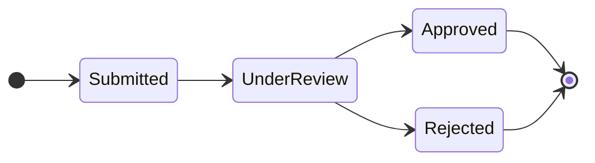
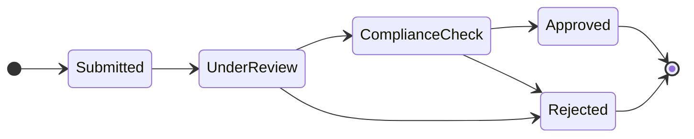

# Evolving Event-Sourced Systems: Schema and Process Versioning

You built an event-sourced system. It is in production, users depend on it daily, and the event store grows with every interaction. Then the inevitable happens — requirements change. **A data model needs a new field, a workflow gains a new step, and the API contract between your services shifts beneath your feet.**

In traditional systems, you would run a database migration, update your code, and move on. **In event sourcing, there is no "ALTER TABLE."** Every event you ever stored still exists, and your aggregates replay those events to reconstruct their current state. Change the shape of an event, and every replay breaks.

<!-- more -->

This article tackles **three distinct problems** that arise when you evolve an event-sourced system in production. First, I will show you how to handle schema evolution using a technique called **event upcasting**. Then, I will walk you through **versioned state machines** that let new and existing processes coexist without conflict. Finally, I will demonstrate how a **command interceptor** can enforce version compatibility between clients and your server. This is part one of a two-part series — in the [second article](../handling-rule-changes-in-running-processes.md), I will explore what happens when business rules change while processes are already running.

## Event Upcasting: When Your Event Schema Evolves

Imagine you launched your loan application system six months ago. Back then, a `LoanApplicationSubmittedEvent` carried an `applicantName` as a single string and an `amount` for the requested loan. **The system worked, and thousands of these events now live in your event store.** Today, compliance requires you to capture the applicant's credit score at submission time, and your domain model needs `firstName` and `lastName` as separate fields.

The challenge might seem impossible at first glance. **You cannot modify the stored events** — immutability is the very foundation of event sourcing. You also cannot simply change your event class and hope for the best, because replaying the aggregate will fail the moment it encounters old events that lack `creditScore` and still carry `applicantName`. What you need is a way to transform old events into the new shape during replay, without ever touching the event store.

**This is exactly what an upcaster does.** An upcaster is a transformation function that intercepts events during deserialization, before they reach your event handlers. It operates on the serialized representation — typically JSON — restructuring fields, adding defaults, and migrating data to match the current schema. You register upcasters in a chain, where each one handles exactly one version transition: V1 to V2, V2 to V3, and so on.

To make this work, you annotate your event class with a **revision marker** so the system knows which version each stored event belongs to. The current version of your event class reflects the latest schema with separate name fields and a credit score. Here is what the V2 event looks like:

```kotlin
@Revision("2")
data class LoanApplicationSubmittedEvent(
    val applicationId: ApplicationId,
    val firstName: String,
    val lastName: String,
    val amount: BigDecimal,
    val creditScore: Int,
)
```

The upcaster handles the V1-to-V2 transformation by operating directly on the JSON structure before deserialization occurs:

```kotlin
class LoanApplicationSubmittedEventUpcaster : EventUpcaster {

    override fun upcast(event: JsonNode): JsonNode {
        val fullName = event.get("applicantName").asText()
        val parts = fullName.split(" ", limit = 2)

        return event.toMutable().apply {
            remove("applicantName")
            put("firstName", parts.first())
            put("lastName", parts.getOrElse(1) { "" })
            put("creditScore", 0)
        }
    }
}
```

Notice that **the upcaster works on raw JSON, not on typed objects**. This is a deliberate design choice — it runs before deserialization, so your event class only needs to represent the latest schema. The `creditScore` receives a default of zero for historical applications, which is a perfectly valid representation of "this data was not captured at the time." Each upcaster handles one version step, and the system chains them automatically when an event needs to jump multiple versions.

Sometimes, however, **a sensible default simply does not exist**. Imagine a later iteration introduces a `riskCategory` field that classifies every application as `LOW`, `MEDIUM`, or `HIGH` based on the requested amount. Setting this to a placeholder would be dangerous — downstream logic relies on the category to route applications through different review paths. In this case, the upcaster must compute the value from existing data in the event. Here is what a V2-to-V3 upcaster looks like when it needs to apply a business rule rather than a default:

```kotlin
class LoanApplicationSubmittedEventV2ToV3Upcaster : EventUpcaster {

    override fun upcast(event: JsonNode): JsonNode {
        val amount = event.get("amount").asDouble()

        val riskCategory = when {
            amount > 50_000 -> "HIGH"
            amount > 10_000 -> "MEDIUM"
            else -> "LOW"
        }

        return event.toMutable().apply {
            put("riskCategory", riskCategory)
        }
    }
}
```

**This is where upcasting becomes more than a schema migration — it becomes a retroactive application of business logic.** The upcaster derives the risk category from the loan amount using the same rules that new events would apply at creation time. Every historical event now carries a consistent classification, even though that concept did not exist when the event was originally stored. This distinction matters: a default says "we did not know," while a computed value says "we can reconstruct what it would have been." **Your events are immutable, but your interpretation of them does not have to be — upcasters let you evolve your understanding of the past without rewriting history.**

## State Model Versioning: When the Process Itself Changes

Event upcasting solves the problem of evolving data, but **what happens when the process itself needs to change?** Consider your loan application workflow. When you launched, the process was straightforward: an application moves from Submitted to Under Review, and then to either Approved or Rejected. New regulations now require a mandatory compliance check between the review and the approval step.

This creates a tension that is unique to long-running processes. **You cannot retroactively insert a compliance step for applications that have already passed the review stage.** Those 500 in-flight applications were processed under the rules that existed when they started, and forcing them into a new workflow would create chaos. At the same time, every new application must go through the compliance check from day one.

The solution is to **version your state machines**. Each process instance records which version of the state model it was started with, and that version stays pinned for the lifetime of the process. New applications receive the latest version with the compliance step. Existing applications continue with their original version, finishing their workflow exactly as it was defined when they began.

Here is what the two versions look like side by side. The V1 workflow follows the original three-step process:



The V2 workflow adds the compliance check as a mandatory step before approval:



You capture the version assignment as an event at the moment the process starts. When the system replays the aggregate, it reads this event first and initializes the correct state machine before processing any subsequent state transitions. **This means your aggregate always reconstructs with the exact workflow that governed it from the beginning.** The following code shows how you define the two versions as an enum and how the version event pins the state machine at process start:

```kotlin
enum class LoanProcessingModel(
    val stateMachine: () -> StateMachine<String, ProcessingTrigger>,
) {
    V1({
        stateMachine {
            state("Submitted") { on("StartReview") transitionTo "UnderReview" }
            state("UnderReview") {
                on("Approve") transitionTo "Approved"
                on("Reject") transitionTo "Rejected"
            }
        }
    }),
    V2({
        stateMachine {
            state("Submitted") { on("StartReview") transitionTo "UnderReview" }
            state("UnderReview") {
                on("PassReview") transitionTo "ComplianceCheck"
                on("Reject") transitionTo "Rejected"
            }
            state("ComplianceCheck") {
                on("Approve") transitionTo "Approved"
                on("Reject") transitionTo "Rejected"
            }
        }
    }),
}

data class ProcessingModelVersionSpecifiedEvent(
    val applicationId: ApplicationId,
    val version: String,
)
```

**Versioning is not just for data — it is for behavior.** By versioning your process models, you decouple "how new processes work" from "how existing processes finish." This gives you the freedom to evolve your workflows aggressively without disrupting anything that is already in flight. The state model version becomes part of your aggregate's identity, as fundamental as the data it carries.

## Interface Version Blocking: When Client and Server Diverge

So far, I have covered changes that happen inside your system — event schemas and process models. But there is an equally important boundary to manage: **the contract between your server and its clients**. You deploy a new version of your loan application service that expects commands in an updated format. Meanwhile, frontend instances, mobile apps, and downstream services still send commands based on the old interface contract.

In a traditional REST API, you might handle this with URL versioning or content negotiation. **In a command-based architecture, the problem is more subtle.** A command that was valid yesterday might carry semantics that conflict with today's server logic. Processing it silently could lead to data corruption, inconsistent state, or error messages that make no sense to the user.

The solution is a **command interceptor** — a piece of cross-cutting logic that runs before every command reaches its handler. Think of it as middleware for your command bus. Each command carries an interface version number in its metadata, and the interceptor compares that version against the server's current version. If they match, the command proceeds normally. If they do not match, **the interceptor rejects the command immediately** with a clear error that tells the client to refresh.

The implementation is remarkably straightforward. You define your version constants in a central location and wire up the interceptor to check every incoming command. Here is what this looks like:

```kotlin
object Versions {
    const val CURRENT_INTERFACE_VERSION = 5
    const val METADATA_KEY = "interfaceVersion"
}

class InterfaceVersionBlockingInterceptor : CommandInterceptor {

    override fun handle(
        command: CommandMessage<*>,
        chain: InterceptorChain,
    ): Any? {
        val clientVersion = command.metadata[Versions.METADATA_KEY] as? Int

        if (clientVersion != null && clientVersion != Versions.CURRENT_INTERFACE_VERSION) {
            throw InterfaceVersionMismatchException(
                "Server runs interface version ${Versions.CURRENT_INTERFACE_VERSION}, " +
                    "but received command with version $clientVersion. Please refresh."
            )
        }

        return chain.proceed()
    }
}
```

The interceptor reads the version from the command's metadata and compares it against the server's current version constant. **A mismatch results in an immediate, explicit rejection** — no silent processing, no partial updates, no confusing downstream errors. The client receives a clear signal to refresh and retry. **In distributed systems, you do not control when clients update, but an interface version gate turns silent incompatibility into a recoverable error.**

## What Comes Next

You have now seen three layers of evolution that every event-sourced system eventually needs. **Event upcasting** handles schema changes by transforming old events during replay, keeping your event store immutable while your models evolve. **State model versioning** pins each process to the workflow that governed it at creation, letting new and old processes coexist without conflict. **Interface version blocking** enforces compatibility at the system boundary, preventing stale clients from sending commands your server no longer understands.

These three patterns share a common philosophy: **evolution must be explicit**. You do not silently hope that old data fits new models. You do not assume that all clients are up to date. Instead, you build versioning into your architecture from day one, making every transition traceable and every mismatch recoverable.

But there is a harder question I have not yet addressed. What happens when a business rule changes — not the schema, not the workflow, but the rule itself — and you need running processes to pick up that change? **What if a threshold shifts, a validation tightens, or a pricing model evolves while hundreds of processes are in flight?** That is where things get truly interesting, and it is exactly what I will cover in the [next article](../handling-rule-changes-in-running-processes.md).
