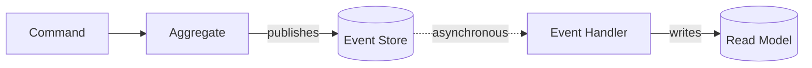
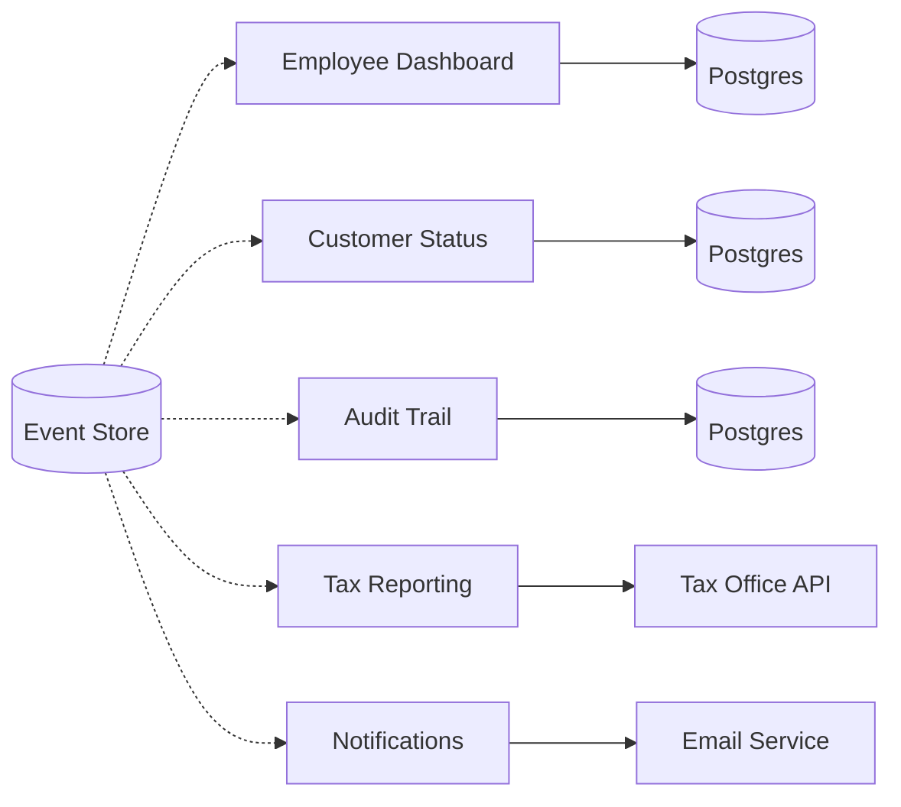

# One Truth, Many Views: Understanding Read Models in Event Sourcing

If you have spent any time building web applications, you are familiar with a pattern so ubiquitous that it feels like a law of nature. **You have a database, you write data to it, and you read data from it — same tables, same schema, same source.** Your `SELECT` queries run against the same rows your `INSERT` statements created. The mental model is simple: one database serves all purposes, and every part of your application sees the same data in the same shape.

**Event sourcing breaks this assumption.** In an event-sourced system, your write side does not store rows in a table — it stores a sequence of events in an event store. When a customer submits a loan application, you do not write an `applications` row with columns for name, amount, and status — instead, you store a `LoanApplicationSubmittedEvent` that captures the fact that something happened. Your business logic replays these events to reconstruct the current state of the application, makes its decision, and publishes more events. The data is there, but it lives in a stream of facts, not in a queryable table.

This raises an immediate and practical question. **Where does the data for your user interface come from?** A bank employee needs a dashboard showing all pending applications with their risk categories. A customer needs a status page confirming that their application is under review.

<!-- more -->

An auditor needs a complete trail of every decision made on every application, while the tax office expects automated reports on approved loans. **The answer is read models — purpose-built data structures that transform your event stream into exactly the shape each consumer needs.** This is the first article in the **CQRS & Event Sourcing Essentials** series, and it will show you what read models are, why they exist, and how they change the way you think about data. The code examples throughout this article use **[OpenCQRS](https://github.com/open-cqrs/opencqrs)** 1.0.0, but the underlying concepts apply to any event-sourced system.

## What Read Models Are

**A read model is a data structure that you build by listening to events.** It is not a mirror of your event store, and it is not a cache of your aggregate's internal state. It is an independent, purpose-built representation of your data, optimized for a specific consumer or use case. You might store it in a Postgres table, keep it in an in-memory map, push it to an Elasticsearch index, or even materialize it as an outgoing API call. The storage technology does not matter — what matters is that **the read model contains exactly the data its consumer needs, in exactly the shape they need it.**

The mechanism behind a read model is an **event handler**. An event handler is a function that reacts to events after they have been stored in the event store. It receives the event, extracts the relevant information, and writes it into the read model's storage. This happens **asynchronously** — the event handler runs in its own processing group, independent of the command that produced the event. The command returns immediately after storing its events; the read model updates moments later.

To make this concrete, consider the bank employee who needs to see all submitted loan applications. Every time a customer submits an application, an event handler picks up the resulting event and writes a row to the employee dashboard table. The following diagram shows the complete flow from the initial command through the aggregate, the event store, and finally to the read model:



The event handler observes the event store, picks up the `LoanApplicationSubmittedEvent`, and transforms it into a row for the employee dashboard table. Unlike the aggregate that produced the event, **the event handler runs in its own processing group** — completely decoupled from the command execution path. Here is what that handler looks like in code:

```kotlin
@EventHandling("employee-dashboard")
fun on(event: LoanApplicationSubmittedEvent, repository: EmployeeDashboardRepository) {
    val entry = EmployeeDashboardEntry(
        applicationId = event.applicationId,
        applicantName = "${event.firstName} ${event.lastName}",
        amount = event.amount,
        riskCategory = categorize(event.amount),
        status = "Submitted",
    )
    repository.save(entry)
}
```

Notice what happens in this handler. **It does not just copy event fields into a table — it transforms the data.** It concatenates first and last name into a display-friendly format, computes a `riskCategory` from the loan amount, and sets a human-readable status string. The employee dashboard table has a different shape than the event, because the employee has different needs than the aggregate that produced the event. **A read model is not a mirror of your event store — it is a deliberate transformation of events into the shape a specific consumer needs.**

## Why the Write Model Cannot Serve Reads

If you come from a CRUD background, you might wonder **why you cannot simply query the aggregate's state**. After all, the aggregate knows the current status of every loan application — why not expose that data directly? The answer lies in understanding what the aggregate is actually for, and how it reconstructs its state.

An aggregate in an event-sourced system rebuilds its state by replaying events through **state rebuilding handlers**. These handlers are fundamentally different from event handlers. They run **synchronously, during command execution**, and their sole purpose is to reconstruct just enough state for the aggregate to validate the next command. They are not designed to serve queries, and they produce a data structure that is optimized for business decisions, not for display.

Consider what happens when the aggregate needs to process a new command on an existing loan application. It reads all stored events for that application and passes each one through the matching state rebuilding handler to reconstruct the current state. Here is what that handler looks like for the initial submission event:

```kotlin
@StateRebuilding
fun on(event: LoanApplicationSubmittedEvent): LoanApplication {
    return LoanApplication(
        applicationId = event.applicationId,
        status = ApplicationStatus.SUBMITTED,
        amount = event.amount,
        creditScore = event.creditScore,
    )
}
```

Compare this to the event handler you saw earlier. **Both handle the same event, but they serve completely different purposes.** The state rebuilding handler creates a `LoanApplication` object with an enum status and a credit score — data the aggregate needs to decide whether the next command is valid. The event handler creates an `EmployeeDashboardEntry` with a formatted name, a derived risk category, and a human-readable status — data the bank employee needs to see on their screen. The aggregate does not know about display names or risk categories, and the dashboard does not know about credit scores or enum-based statuses.

This architectural boundary is not accidental — **it is the entire point.** The aggregate answers "can this command execute?" — the read model answers "what should the user see?" Mixing these concerns would force your aggregate to carry display logic, your read model to understand business rules, and every change to either side to ripple through both. **Keeping them separate means each side can evolve independently, optimized for its own purpose.**

## One Event Stream, Many Read Models

The real power of read models reveals itself when you realize that **a single event stream can feed any number of independent projections**. Every event in your loan application system carries a piece of truth about what happened. Different consumers extract different meaning from that same truth, and each consumer deserves a read model tailored to their needs.

Consider the stakeholders in a loan application process. **The bank employee needs a dashboard** with application details, risk categories, and processing status. **The customer** needs a simple status page — just "submitted," "under review," or "decided," with no internal details. **An auditor** needs a complete, timestamped trail of every decision and state change, while **the tax office** expects automated data transmissions for approved loans above a certain threshold. The following diagram shows how all of these consumers feed from the same event stream, each with their own handler and their own storage target:



Each handler runs in its own **processing group**, independently of the others. If the tax reporting handler goes down for maintenance, the employee dashboard and customer status page continue updating without interruption. If you need to add a new consumer next month — say, an analytics pipeline feeding a data warehouse — **you add a new event handler and let it replay the entire event history from the beginning.** No existing code changes, no migrations, no coordination.

But read models are not limited to database tables. The notification handler in the diagram above does not write a row — **it sends an email.** When a loan application receives a decision, the handler reacts to the event and notifies the customer:

```kotlin
@EventHandling("notifications")
fun on(event: LoanApplicationDecidedEvent, emailService: EmailService) {
    emailService.send(
        to = event.applicantEmail,
        subject = "Your Loan Application Update",
        body = "Your application has been ${event.decision.lowercase()}.",
    )
}
```

This broadens the concept of what an event handler can do. **Sending an email, calling an external API, publishing a message to a queue** — these are all legitimate reactions to events, built with the same mechanism as a database projection. The pattern is the same: listen to events, extract what you need, produce an output tailored to the consumer. **The same events can tell completely different stories depending on who is listening.**

## The Golden Rule — Read Models Do Not Make Decisions

There is one rule about read models that, once you internalize it, will prevent an entire category of architectural mistakes. **You must never load a read model inside a command handler to inform a business decision.** Business rules operate on aggregate state — the state that your state rebuilding handlers reconstruct from events. That is the single source of truth for decision-making, and it is the only data you should trust when validating a command.

The reason is fundamental to how read models work. **Read models are eventually consistent.** When a command handler publishes an event, the event is stored in the event store immediately, but the read models update asynchronously, moments later. If you query a read model inside a command handler, you might be looking at stale data — data that does not yet reflect the event you just stored, or that another concurrent command produced seconds ago. Building business logic on stale data leads to decisions that contradict the actual state of your system.

There is a deeper reason, too. **Read models are disposable.** You can delete an entire read model's database table, replay all events from the beginning, and rebuild it from scratch. This is one of the great advantages of event sourcing — your read models are derived data, not source data. If you discover that your employee dashboard needs an extra column, you add it to the event handler, delete the old table, and replay.

If you ever find yourself injecting a read model repository into a command handler, **treat it as a design signal.** It means your aggregate is missing information that it should carry in its own state. The fix is not to query the read model — the fix is to ensure your aggregate's state rebuilding handlers capture the data your business rules need. Your aggregate should be self-sufficient for decision-making, reconstructing everything it needs from its own event stream. **Read models are disposable and rebuildable — your business logic must never depend on something you could delete and reconstruct without consequences.**

## What Comes Next

**Read models are not a workaround for the absence of tables in event sourcing.** They are the mechanism that turns a single stream of truth into exactly the data each consumer needs. The bank employee, the customer, the auditor, and the tax office all look at the same loan application, but each sees a different story — **a story shaped by an event handler that transforms raw events into a purpose-built representation.**

You have seen that **read models are built asynchronously by event handlers**, that **state rebuilding handlers serve a fundamentally different purpose**, and that the same events can feed any number of independent projections. You have learned the golden rule: read models do not make decisions. They inform users, generate reports, and trigger side effects, but they never participate in the command handling path.

This is the power of separating reads from writes. In a traditional system, your database schema is a compromise between what you need to store and what you need to query — **in an event-sourced system, you store the truth once and build as many optimized views as you need.** Read models are not a limitation — they are an architectural advantage that CRUD systems simply do not have. In the next article in this series, I will take a closer look at the other side of the equation — the aggregates and commands that produce the events your read models consume.
