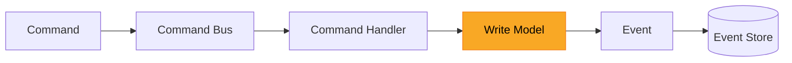

# The Write Model: Where Business Logic Lives

Every software system makes decisions. When a customer submits a loan application, something in your code decides whether that application is valid. When an employee approves a claim, something verifies that the approval is allowed. These decisions are the most important thing your software does - they are the reason the system exists.

When you think about software from the domain's perspective - what the business actually does, what decisions it makes, what rules it enforces - a natural question emerges: where in the code does all of this live? Domain-Driven Design encourages thinking in terms of business processes and decisions rather than data structures and technical layers. CQRS and event sourcing take this further by giving the decision-making part of your system an explicit, well-defined home: **the write model**.

The write model is the single, self-contained unit that takes the current state of your system, applies your business rules, and produces a decision - nothing gets written without passing through it first. In the **[previous article in this series](../2026-03-19-one-truth-many-views/index.md)**, I explored read models - purpose-built data structures that transform your **[event stream](../../../../concepts/event_sourcing/index.md)** into exactly the shape each consumer needs. This article looks at the other side of the equation: where read models answer "what should the user see?", the write model answers "is this operation allowed, and what happens as a result?"

<!-- more -->

## What a Write Model Really Is

**A write model is a self-contained unit that makes business decisions.** It receives the current state (1) and an incoming request, applies business rules, and produces an outcome - either a rejection or a set of changes to record. That is the entire scope of its responsibility. No emails, no dashboard updates, no calls to external services - just rules and a decision.
{ .annotate }

1.  In an event-sourced system, the current state is not stored directly - it is reconstructed by replaying all prior events through state rebuilding handlers. In OpenCQRS, this reconstruction happens automatically before your command handler executes. See **[State Rebuilding Handlers](../../../../reference/extension_points/state_rebuilding_handler/index.md)** for details.

The simplest way to see this is to strip away every framework and buzzword and look at the raw logic underneath. Consider the loan application scenario from the introduction. Before the system can accept a new application, it must verify two things: the applicant has no other open application, and the requested amount does not exceed the allowed maximum. Here is a write model that enforces exactly those two rules - written as a plain function:

```kotlin
data class LoanApplicationState(
    val hasOpenApplication: Boolean,
    val maximumAllowedAmount: BigDecimal
)

data class SubmitLoanApplication(
    val applicantId: String,
    val requestedAmount: BigDecimal
)

fun submitApplication(
    state: LoanApplicationState,
    command: SubmitLoanApplication
): LoanApplicationSubmittedEvent {

    check(!state.hasOpenApplication) {
        "Applicant already has an open application"
    }
    require(command.requestedAmount <= state.maximumAllowedAmount) {
        "Requested amount exceeds the allowed maximum"
    }

    return LoanApplicationSubmittedEvent(
        applicantId = command.applicantId,
        requestedAmount = command.requestedAmount
    )
}
```

Look at what this function does. It takes the current state and a command, checks two business rules, and either rejects the request or produces an event. There is no database access, no HTTP call, no framework annotation anywhere in sight. The function is deterministic - the same state and the same command will always produce the same result. Everything the function needs to make its decision arrives as input.

**This is already a write model.** Not a simplified version, not a stepping stone toward a "real" implementation - this is the thing itself. A write model is a function of state and intent that produces a business decision, and everything you wrap around it - frameworks, persistence, command buses - is infrastructure. If you can point to the place in your code where business rules are evaluated and decisions are made, you are pointing at your write model.

??? tip "Write models in OpenCQRS"
    In OpenCQRS, the write model is the state that your state rebuilding handlers reconstruct from events, combined with the business rules in your command handler. The framework handles the infrastructure - loading events, rebuilding state, persisting new events - so your code focuses entirely on the decision logic. See **[Defining Command Handlers](../../../../reference/extension_points/command_handler/index.md)** for details on how OpenCQRS structures this separation.

## The Form Is Not the Essence

If you have spent time with Domain-Driven Design or **[event sourcing](../../../../concepts/event_sourcing/index.md)** literature, you have almost certainly encountered the aggregate pattern. An aggregate groups related state and behavior into a single object that enforces business invariants, and it is one of the most recognized patterns in the field. Many developers treat "aggregate" and "write model" as interchangeable terms. They are not.

To see why, here is the exact same loan application logic from the previous section, now packaged as a class that manages its own state. The business rules have not changed - only the structure around them has. Compare this to the plain function above:

```kotlin
class LoanApplication(
    private val hasOpenApplication: Boolean,
    private val maximumAllowedAmount: BigDecimal
) {

    fun submit(command: SubmitLoanApplication): LoanApplicationSubmittedEvent {

        check(!hasOpenApplication) {
            "Applicant already has an open application"
        }
        require(command.requestedAmount <= maximumAllowedAmount) {
            "Requested amount exceeds the allowed maximum"
        }

        return LoanApplicationSubmittedEvent(
            applicantId = command.applicantId,
            requestedAmount = command.requestedAmount
        )
    }
}
```

The rules are identical. The decision is identical. The only difference is where the state lives - passed in as a parameter, or stored as fields on an object. Both versions qualify as write models because both fulfill the same contract: take state, apply rules, produce a decision. The aggregate pattern adds structure by co-locating state and behavior, but that structure is a design choice, not a requirement.

This distinction sharpens further when you consider **Dynamic Consistency Boundaries** - an approach that challenges the fixed boundaries traditional aggregates impose. In the aggregate pattern, you decide at design time which data belongs together, and that boundary never moves. Dynamic Consistency Boundaries flip this around: the boundary is determined at decision time, based on what the current command actually needs. If approving a loan application requires checking the applicant's total outstanding debt across all their applications, the boundary expands to include that data. If a simpler command only needs the state of a single application, the boundary contracts.

??? info "OpenCQRS and consistency boundaries"
    OpenCQRS supports flexible consistency boundaries through its command handling architecture. Each **[Command](../../../../reference/extension_points/command_handler/index.md)** specifies its own subject at execution time, and the **[Command Router](../../../../reference/core_components/command_router/index.md)** uses the configured sourcing mode to determine which events to load - from a single subject or recursively across child subjects. This means you can model business decisions that span multiple subjects without sacrificing consistency guarantees.

What stays constant across all of these approaches is the write model's job: receive state, apply rules, produce a decision. Aggregates are one shape a write model can take, a plain function is another, and a dynamically bounded decision unit is a third. The form you choose depends on what your system needs. But now you know it is a choice, not a constraint.

## Write Model vs. Write Side

There is a second distinction that matters just as much, and even experienced practitioners sometimes blur it. **The write model and the write side are not the same thing.** The write model is the decision logic - the rules and the state they evaluate. The write side is everything involved in handling a write operation, from the moment a command enters your system to the moment an event is persisted.

The following diagram shows where the write model sits within the larger write side:



The command bus routes the incoming command to the correct handler. The **[command handler](../../../../reference/extension_points/command_handler/index.md)** loads the current state, passes it to the write model, and receives the decision back. If the write model produces events, the handler persists them in the event store. If the write model rejects the command, the handler translates that rejection into an error response. Every component in this pipeline except the write model itself is infrastructure - **the write model is only the yellow box in the middle**.

??? tip "The write side in OpenCQRS"
    OpenCQRS maps these write side components directly to its architecture. The command bus is the **[Command Router](../../../../reference/core_components/command_router/index.md)**, which routes commands to the correct handler. Events are loaded through the **[Event Repository](../../../../reference/core_components/event_repository/index.md)** and then applied by **[State Rebuilding Handlers](../../../../reference/extension_points/state_rebuilding_handler/index.md)** to reconstruct instance state. Your write model - the business rules - stays cleanly separated from all of this infrastructure.

When you conflate the write model with the write side, infrastructure starts leaking into your business logic. You end up with command handlers that contain validation rules, write models that manage database transactions, or business logic scattered across middleware - and suddenly there is no single place where you can point and say "this is where the decision happens." Keeping the boundary sharp prevents this drift entirely.

The practical payoff is testability. Your write model is pure logic - you can test it by constructing state, calling the function, and asserting the result, without a database, a message broker, or a running application (1). Your write side is infrastructure - it handles routing, state loading, persistence, and error translation. Changes to how you persist events do not affect your business rules. Changes to your business rules do not affect how commands are routed.
{ .annotate }

1.  OpenCQRS provides a dedicated test fixture that makes this pattern concrete. You supply prior events, execute a command, and assert the outcome - all without any infrastructure. See **[Command Handling Tests](../../../../reference/test_support/command_handling_test_fixture/index.md)** for the full API.

## Why This Matters

Everything I have described - the self-contained decision unit, the independence from any specific pattern, the separation from infrastructure - serves a purpose that goes beyond architectural aesthetics. **The write model is the contract between your business and your code.** When a product owner says "applications above $50,000 require manual review," there should be exactly one place in your codebase where that rule lives - one place, one truth.

This has immediate practical consequences. When a business rule changes, you change one thing - you open the write model, modify the rule, and the system reflects the new reality. The write model is the single authority, and everyone - developers, testers, product owners - knows where to look.

The write model also draws a hard line on one of the hardest questions in software architecture: where exactly does business logic end and infrastructure begin? Everything inside the write model is business logic, everything outside it is infrastructure. No gray area, no ambiguity about where a new rule belongs.

Connect this back to the **[read models from the previous article](../2026-03-19-one-truth-many-views/index.md)**. Read models serve consumers - they transform events into exactly the data each user, dashboard, or external system needs. The write model serves the business rules - it is the sole authority over what is allowed and what is not. Together, they form the two halves of **[CQRS](../../../../concepts/cqrs/index.md)**: the write model decides, the read models display. Neither side depends on the other, and both evolve independently - that is not architectural elegance for its own sake, it is the reason your system can grow without collapsing under its own weight.

## What you have learned

You have seen that a plain function qualifies as a write model if it fulfills the contract: state in, decision out. You have seen that aggregates are one shape, not the definition. The separation between write model and write side keeps your business logic pure and your infrastructure replaceable. The write model is where your business rules live, where you go when requirements change, and the contract that keeps your business and your code aligned.
