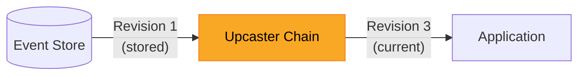
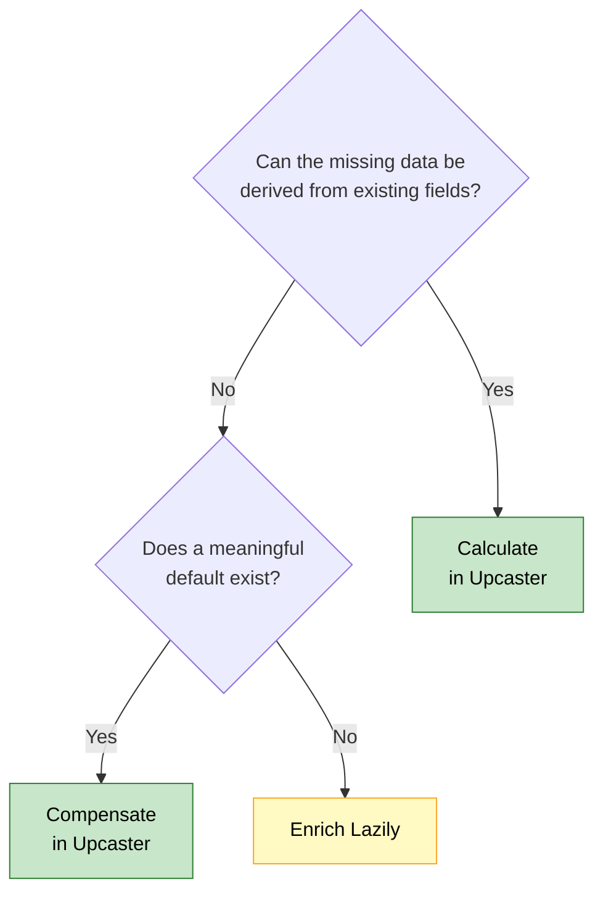

# Evolving Event-Sourced Systems

Changing a data model is never trivial, regardless of the persistence strategy. In a traditional system, you write a migration script, add the new column, figure out how to backfill existing rows without breaking anything, and deploy. That process comes with its own challenges - choosing sensible defaults, coordinating with running applications, handling rollbacks - but at least the mechanism is familiar. Once the migration runs, every query sees the new structure.

Event sourcing introduces a different kind of challenge. Every state change in your system is stored as an immutable **[event](../../../../concepts/events/index.md)**, and those events accumulate over time - months, years, sometimes decades of recorded facts. This immutability is one of the core strengths of event sourcing: it gives you a complete audit trail, the ability to replay history, and the freedom to build new projections from existing data. But when a new requirement demands a field that did not exist six months ago, the immutability that protects your history also means you cannot simply alter what is already stored.

This is the schema evolution problem, and it is one of the first real challenges teams encounter after adopting event sourcing. There is a clear set of strategies for handling it, and none of them require modifying the events in the store. This article - the first in the **System Evolution & Business Logic** series - walks through three approaches: calculating missing data, compensating with defaults, and enriching lazily. By the end, you will know exactly which strategy to reach for when your schema needs to change.

<!-- more -->

## The Immutability Contract

In an event-sourced system, the event store is the single source of truth (1). Every event that has ever been published lives there in exactly the form it was written - unchanged, undeleted, unmodified. This immutability is not a limitation to work around - it is the feature that makes audit trails, temporal queries, and full state reconstruction possible. Every guarantee your system offers rests on the fact that the historical record is trustworthy.
{ .annotate }

1.  In OpenCQRS, the event store is backed by the **[Event Repository](../../../../reference/core_components/event_repository/index.md)**, which provides append-only persistence for domain events. Events are stored with their type, revision, and payload - the building blocks that upcasters operate on.

When your application needs to reconstruct the current state of an entity, it reads every event for that entity from the store and replays them in order. Each event contributes a piece of the state, and the final result is the entity as it exists right now. This works perfectly as long as every event matches the schema your application expects. The moment your code expects a field that old events do not carry, the replay breaks.

The traditional migration approach - alter the schema, backfill the data, deploy the new code - does not apply here. The events in the store represent facts about what happened, and rewriting them would undermine the very guarantee that makes event sourcing valuable. Instead, you need strategies that bridge the gap between old event schemas and new application expectations without touching the stored events themselves.

This is the key mental shift: **schema evolution in event sourcing happens at read time, not write time.** The store never changes. Your application adapts to what the store contains, transforming old representations into the shape the current code expects.

## Event Upcasting - Transforming on Read

**[Event upcasting](../../../../concepts/upcasting/index.md) is the primary mechanism for schema evolution in event sourcing.** An upcaster sits between the event store and your application, intercepting events as they are read and transforming them from their stored schema to the current one. The event in the store remains exactly as it was written - the upcaster produces a new, transformed representation that your application code works with. From the application's perspective, every event looks like it was written with the current schema.

The following diagram shows where the upcaster sits in the read path:



The simplest case is when the missing data can be **calculated from fields that already exist in the event**. Consider the loan application domain. Your system has been storing `LoanApplicationSubmittedEvent` events for months, each containing a `locationType` field that records whether the applicant's address was verified in person or via postal mail. A new requirement demands a boolean `verifiedAddress` field - and the answer is already there in the existing data.

```kotlin
class AddVerifiedAddressUpcaster {

    fun canUpcast(eventType: String, revision: Int): Boolean =
        eventType == "LoanApplicationSubmittedEvent"
            && revision == 1

    fun upcast(payload: ObjectNode): ObjectNode {
        val locationType = payload.path("locationType").asText()
        payload.put("verifiedAddress", locationType == "POSTAL")
        return payload
    }
}
```

The upcaster checks whether the event is a revision 1 `LoanApplicationSubmittedEvent`, and if so, derives `verifiedAddress` from the existing `locationType` field. The event in the store still carries revision 1 with no `verifiedAddress` field, but every consumer that reads the event through the upcaster sees revision 2 with the field correctly populated. No migration, no downtime, no data loss.

??? tip "Upcasting in OpenCQRS"
    OpenCQRS provides built-in support for event upcasting through its event deserialization pipeline. Upcasters are registered as components and applied automatically when events are read from the store. See **[Event Upcasting](../../../../concepts/upcasting/index.md)** for the full concept and **[Upcasting Events](../../../../howto/upcasting_events/index.md)** for a step-by-step guide.

The second case is when the missing data cannot be derived, but **a sensible default preserves correct behavior**. A few weeks later, your system needs a `riskCategory` field on every loan application event. Historical events carry no such information, and there is no way to calculate the category from existing fields. However, all historical applications were processed under standard risk rules, so `STANDARD` as the default accurately reflects what happened at the time.

```kotlin
class AddRiskCategoryUpcaster {

    fun canUpcast(eventType: String, revision: Int): Boolean =
        eventType == "LoanApplicationSubmittedEvent"
            && revision == 2

    fun upcast(payload: ObjectNode): ObjectNode {
        payload.put("riskCategory", "STANDARD")
        return payload
    }
}
```

This upcaster takes revision 2 events - already transformed by the previous upcaster - and adds the missing `riskCategory`. Upcasters chain naturally: each one transforms from one revision to the next, and the event passes through all applicable upcasters in sequence. Between calculation and compensation, upcasting handles the vast majority of schema changes you will encounter in practice. But there is a boundary where both strategies fail.

## When Upcasting Is Not Enough

Upcasting works when the missing information exists implicitly in the event or when a default can stand in for reality. But what happens when neither condition holds? A new regulation requires every loan application to carry a `manualReviewResult` - the documented outcome of a human review that determines whether the application is compliant. This field cannot be calculated from any existing data in the event, because no review was conducted at the time the event was written.

There is no default that makes sense here either. Applications that have already been fully processed and decided are not affected - their event streams already contain the decision events that followed, and their state is complete. The problem lies with applications that are still in progress: they have been submitted but not yet reached a final decision. These entities need the new field before the next command can be processed, and the data simply does not exist in their event history.

The solution is to stop trying to transform the event and instead enrich the entity's state before it processes its next command. This is not a read-time transformation like upcasting - it is an explicit write operation that records the missing information as a new event in the entity's stream. This approach is called **lazy enrichment**, and it fills the gap that upcasting cannot reach.

## Lazy Enrichment - Supplying Missing Data

**Lazy enrichment adds missing data to an entity's event stream by publishing a new event before the next command is processed.** Instead of transforming old events at read time, it intercepts the command processing pipeline (1) and ensures the entity is up to date before the actual business logic runs. The enrichment command is idempotent - if the entity already has the data, the command does nothing. This makes it safe to run on every command without worrying about duplicate effects.
{ .annotate }

1.  In OpenCQRS, the command processing pipeline starts at the **[Command Router](../../../../reference/core_components/command_router/index.md)**, which routes commands to their registered **[command handlers](../../../../reference/extension_points/command_handler/index.md)**. The gateway pattern shown later in this section wraps the Command Router to inject enrichment logic before the command reaches the handler.

The mechanism is straightforward. Before your system processes a command on an existing entity, it first sends an enrichment command to that entity. The enrichment handler checks whether the missing data has already been recorded - if not, it publishes an enrichment event that adds the data to the entity's event stream. From that point on, the entity's state includes the new field, and all subsequent state reconstructions see the complete schema. The word "lazy" is key: enrichment happens on demand, the first time the entity is touched after the schema change, not as a batch migration across all entities.

How you intercept the command pipeline depends on what your framework provides. Some frameworks offer built-in interceptors - hooks in the command handling chain that run before every command reaches its handler. The interceptor checks whether the incoming command targets an entity that might need enrichment, dispatches the enrichment command, and then proceeds with the original command. Here is what that looks like:

```kotlin
class EnrichmentInterceptor(
    private val commandBus: CommandBus,
) : CommandHandlerInterceptor {

    override fun handle(
        message: CommandMessage<*>,
        chain: InterceptorChain,
    ): Any? {
        val command = message.payload

        if (command is LoanApplicationCommand
            && command !is EnsureLoanEnrichmentCommand
        ) {
            commandBus.dispatch(
                EnsureLoanEnrichmentCommand(
                    command.applicationId
                )
            )
        }
        return chain.proceed()
    }
}
```

The interceptor dispatches an enrichment command before calling `chain.proceed()`, making the entire process transparent to the business logic downstream. The type check excludes the enrichment command itself to prevent infinite recursion - without that guard, the enrichment command would trigger another enrichment command, and so on. This pattern works well when your framework provides a command handling pipeline, but not every framework does.

When built-in interceptors are not available, you achieve the same result by wrapping the command routing layer in a gateway component. The gateway sits between your application code and the command infrastructure, applying the enrichment logic at the application level instead of the framework level. The pattern is identical - only the integration point changes. Here is the gateway approach:

```kotlin
class LoanCommandGateway(
    private val commandRouter: CommandRouter,
) {

    fun <R> send(command: Command): R {
        if (command is LoanApplicationCommand
            && command !is EnsureLoanEnrichmentCommand
            && command.targetsExistingApplication()
        ) {
            try {
                commandRouter.send(
                    EnsureLoanEnrichmentCommand(
                        command.applicationId
                    )
                )
            } catch (e: SubjectDoesNotExistException) {
                // Entity does not exist yet
            }
        }
        return commandRouter.send(command)
    }
}
```

The gateway adds one check that the interceptor does not need: `targetsExistingApplication()` skips enrichment for commands that create new entities, since there is nothing to enrich yet. The try-catch handles the edge case where the entity has been deleted between the check and the enrichment attempt. Both approaches - interceptor and gateway - produce the same outcome: transparent, idempotent enrichment before every business command, regardless of whether the framework provides built-in pipeline support.

??? info "The gateway pattern and OpenCQRS"
    OpenCQRS does not provide built-in command interceptors, making the gateway pattern the natural fit for lazy enrichment. By wrapping the **[Command Router](../../../../reference/core_components/command_router/index.md)** in a gateway component, you gain full control over the command pipeline without modifying framework internals. The same pattern works for any cross-cutting concern that needs to run before command handling - not just enrichment.

## What You Have Learned

Schema evolution in event sourcing comes down to three strategies, and the decision between them is straightforward. If the missing data can be derived from existing event fields, calculate it in an upcaster. If a meaningful default exists, compensate with it in an upcaster. If neither works, enrich lazily by publishing new events before the next command.

The following diagram captures the decision:



The common thread across all three strategies is that the event store remains untouched. Upcasters transform at read time, producing representations that match the current schema without modifying stored events. Lazy enrichment adds new events to the stream rather than rewriting old ones. The immutability contract - the foundation that makes audit trails, replay, and temporal queries possible - stays intact no matter which strategy you choose.

There is a clear hierarchy to these approaches. Start with the simplest option: can you calculate? If not, can you compensate? Only when both fail do you reach for lazy enrichment. This progression is not just a guideline - it reflects the increasing complexity each strategy introduces. An upcaster is a pure function with no side effects, while lazy enrichment requires command pipeline integration, idempotency guarantees, and awareness of entity lifecycle. Use the lightest tool that solves the problem.

*[event store]: The append-only persistence layer storing all domain events as the single source of truth
*[upcaster]: A component that transforms events from an older schema to the current one at read time, without modifying the stored event
*[event sourcing]: A persistence pattern that stores all state changes as an immutable sequence of events rather than overwriting current state
*[schema evolution]: The process of adapting an event-sourced system to changes in the event data model while preserving historical events
*[lazy enrichment]: A strategy that adds missing data to an entity's event stream on demand, before the next command is processed
*[command handler]: A function that receives a command, loads the current state, applies business rules, and publishes new events
*[idempotent]: An operation that produces the same result regardless of how many times it is executed
*[instance]: A stateful entity in OpenCQRS whose current state is reconstructed by replaying its events
*[read model]: A purpose-built data structure optimized for a specific consumer, derived from events
*[revision]: A version number attached to an event type that tracks its schema evolution over time
