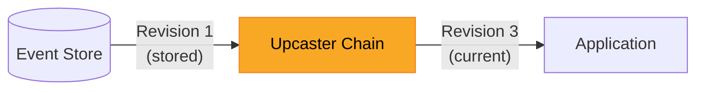
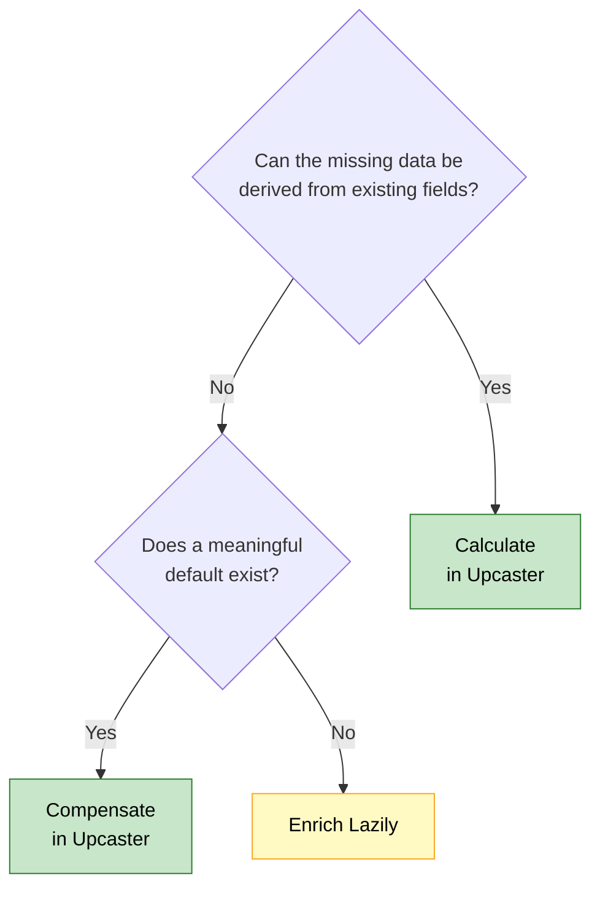

# Evolving Event-Sourced Systems

Changing a data model is never trivial, regardless of the persistence strategy. In a traditional system, you write a migration script, add the new column, figure out how to backfill existing rows without breaking anything, and deploy. That process comes with its own challenges - choosing sensible defaults, coordinating with running applications, handling rollbacks - but at least the mechanism is familiar. Once the migration runs, every query sees the new structure.

Event sourcing introduces a different kind of challenge. Every state change in your system is stored as an immutable **[event](../../../../concepts/events/index.md)**, and those events accumulate over time - months, years, sometimes decades of recorded facts. This immutability is one of the core strengths of event sourcing: it gives you a complete audit trail, the ability to replay history, and the freedom to build new projections from existing data. But when a new requirement demands a field that did not exist six months ago, the immutability that protects your history also means you cannot simply alter what is already stored.

This is the schema evolution problem, and it is one of the first real challenges teams encounter after adopting event sourcing. There is a clear set of strategies for handling it, and none of them require modifying the events in the store. This article - the first in the **System Evolution & Business Logic** series - walks through three approaches: calculating missing data, compensating with defaults, and enriching lazily. By the end, you will know exactly which strategy to reach for when your schema needs to change.

<!-- more -->

!!! abstract "System Evolution & Business Logic series"
    - **Part 1: Evolving Event-Sourced Systems** — schema evolution *(you are here)*
    - [Part 2: Dealing With Business Process Evolution](../2026-06-09-dealing-with-business-process-evolution/index.md) — versioning business logic

## The Immutability Contract

In an event-sourced system, the event store is the single source of truth (1). Every event that has ever been published lives there in exactly the form it was written - unchanged, undeleted, unmodified. This immutability is not a limitation to work around - it is the feature that makes audit trails, temporal queries, and full state reconstruction possible. Every guarantee your system offers rests on the fact that the historical record is trustworthy.
{ .annotate }

1.  In OpenCQRS, the event store is backed by the **[Event Repository](../../../../reference/core_components/event_repository/index.md)**, which provides append-only persistence for domain events. Events are stored with their type, revision, and payload - the building blocks that upcasters operate on.

When your application needs to reconstruct the current state of an entity, it reads every event for that entity from the store and replays them in order. Each event contributes a piece of the state, and the final result is the entity as it exists right now. This works perfectly as long as every event matches the schema your application expects. The moment your code expects a field that old events do not carry, the replay breaks.

The traditional migration approach - alter the schema, backfill the data, deploy the new code - does not apply here. The events in the store represent facts about what happened, and rewriting them would undermine the very guarantee that makes event sourcing valuable. Instead, you need strategies that bridge the gap between old event schemas and new application expectations without touching the stored events themselves.

This is the key mental shift: **schema evolution in event sourcing happens at read time, not write time.** The store never changes. Your application adapts to what the store contains, transforming old representations into the shape the current code expects.

## Event Upcasting - Transforming on Read

**[Event upcasting](../../../../concepts/upcasting/index.md) is the primary mechanism for schema evolution in event sourcing.** An upcaster sits between the event store and your application, intercepting events as they are read and transforming them from their stored schema to the current one. The event in the store remains exactly as it was written - the upcaster produces a new, transformed representation that your application code works with. From the application's perspective, every event looks like it was written with the current schema.

The following diagram shows where the upcaster sits in the read path:



The simplest case is when the missing data can be **calculated from fields that already exist in the event**. Consider the loan application domain. Your system has been storing `LoanApplicationSubmittedEvent` events for months, each containing a `locationType` field that records whether the applicant's address was verified in person or via postal mail. A new requirement demands a boolean `verifiedAddress` field - and the answer is already there in the existing data.

```kotlin
class AddVerifiedAddressUpcaster {

    fun canUpcast(eventType: String, revision: Int): Boolean =
        eventType == "LoanApplicationSubmittedEvent"
            && revision == 1

    fun upcast(payload: ObjectNode): ObjectNode {
        val locationType = payload.path("locationType").asText()
        payload.put("verifiedAddress", locationType == "POSTAL")
        return payload
    }
}
```

The upcaster checks whether the event is a revision 1 `LoanApplicationSubmittedEvent`, and if so, derives `verifiedAddress` from the existing `locationType` field. The event in the store still carries revision 1 with no `verifiedAddress` field, but every consumer that reads the event through the upcaster sees revision 2 with the field correctly populated. No migration, no downtime, no data loss.

??? tip "Upcasting in OpenCQRS"
    OpenCQRS provides built-in support for event upcasting through its event deserialization pipeline. Upcasters are registered as components and applied automatically when events are read from the store. See **[Event Upcasting](../../../../concepts/upcasting/index.md)** for the full concept and **[Upcasting Events](../../../../howto/upcasting_events/index.md)** for a step-by-step guide.

The second case is when the missing data cannot be derived, but **a sensible default preserves correct behavior**. A few weeks later, your system needs a `riskCategory` field on every loan application event. Historical events carry no such information, and there is no way to calculate the category from existing fields. However, all historical applications were processed under standard risk rules, so `STANDARD` as the default accurately reflects what happened at the time.

```kotlin
class AddRiskCategoryUpcaster {

    fun canUpcast(eventType: String, revision: Int): Boolean =
        eventType == "LoanApplicationSubmittedEvent"
            && revision == 2

    fun upcast(payload: ObjectNode): ObjectNode {
        payload.put("riskCategory", "STANDARD")
        return payload
    }
}
```

This upcaster takes revision 2 events - already transformed by the previous upcaster - and adds the missing `riskCategory`. Upcasters chain naturally: each one transforms from one revision to the next, and the event passes through all applicable upcasters in sequence. Between calculation and compensation, upcasting handles the vast majority of schema changes you will encounter in practice. But there is a boundary where both strategies fail.

## When Upcasting Is Not Enough

Upcasting works when the missing information exists implicitly in the event or when a default can stand in for reality. But what happens when neither condition holds? A new regulation requires every loan application to carry a `manualReviewResult` - the documented outcome of a human review that determines whether the application is compliant. This field cannot be calculated from any existing data in the event, because no review was conducted at the time the event was written.

There is no default that makes sense here either. Applications that have already been fully processed and decided are not affected - their event streams already contain the decision events that followed, and their state is complete. The problem lies with applications that are still in progress: they have been submitted but not yet reached a final decision. These entities need the new field before the next command can be processed, and the data simply does not exist in their event history.

The solution is to stop trying to transform the event and instead enrich the entity's state before it processes its next command. This is not a read-time transformation like upcasting - it is an explicit write operation that records the missing information as a new event in the entity's stream. This approach is called **lazy enrichment**, and it fills the gap that upcasting cannot reach.

## Lazy Enrichment - Supplying Missing Data

**Lazy enrichment adds missing data to an entity's event stream by publishing a new event the first time the entity is touched after the schema change.** Instead of transforming old events at read time, it records the missing information as a new event in the entity's stream, on demand, rather than as a batch migration across every entity. The word "lazy" is the point: the enrichment happens when the entity is next processed, not ahead of time.

Lazy enrichment is more involved than upcasting, and there are several ways to shape it. The rest of this section walks through them in ascending order of correctness: a tempting construction that turns out to be structurally broken, a naive first attempt that is correct but wasteful, and the pattern to reach for by default. It closes with a look at what changes when the enrichment cannot happen synchronously.

### Anti-Pattern - Two Commands, Two Commits

The tempting idea is to make enrichment invisible. Wouldn't it be elegant if a gateway or an interceptor quietly dispatched an enrichment command before every business command, so the business logic never had to know? Frameworks like Axon offer command interceptors - hooks that run before a command reaches its handler - and it is easy to reach for one here:

```kotlin
class EnrichmentInterceptor(
    private val commandBus: CommandBus,
) : CommandHandlerInterceptor {

    override fun handle(
        message: CommandMessage<*>,
        chain: InterceptorChain,
    ): Any? {
        val command = message.payload

        if (command is LoanApplicationCommand
            && command !is EnsureLoanEnrichmentCommand
        ) {
            commandBus.dispatch(
                EnsureLoanEnrichmentCommand(
                    command.applicationId
                )
            )
        }
        return chain.proceed()
    }
}
```

The interceptor dispatches an enrichment command before calling `chain.proceed()`, and the type check excludes the enrichment command itself so it does not trigger another enrichment in an endless loop. Notice what this already does to the interceptor, though. Interceptors exist to inspect and enrich the command message as it passes - validation, metadata, correlation data - not to dispatch further commands. Firing a business command from inside one bends the hook out of shape; in production Axon codebases, command interceptors enrich metadata and nothing else, and dispatching a second command from an interceptor is simply not done. When a framework offers no such hook at all, the same two-command idea gets expressed by wrapping the command routing layer in a gateway instead:

```kotlin
class LoanCommandGateway(
    private val commandRouter: CommandRouter,
) {

    fun <R> send(command: Command): R {
        if (command is LoanApplicationCommand
            && command !is EnsureLoanEnrichmentCommand
            && command.targetsExistingApplication()
        ) {
            try {
                commandRouter.send(
                    EnsureLoanEnrichmentCommand(
                        command.applicationId
                    )
                )
            } catch (e: CommandSubjectDoesNotExistException) {
                // The subject does not exist yet
            }
        }
        return commandRouter.send(command)
    }
}
```

Both variants do the same thing: they dispatch **two separate commands** - two separate commits against the event store - with the business command running only after the enrichment command has already been committed. That construction carries three structural defects:

- **No shared transaction across the two sends.** If the second send fails - a business rule rejects it, an optimistic-locking precondition is violated, the store errors - the enrichment event is already committed on its own. The entity is stranded in an intermediate "enriched but not decided" state that no single step ever intended to produce.
- **It invalidates client-side optimistic locking.** A client that reads the entity at a given stream version and sends its business command with a `SubjectIsOnEventId` precondition will see that precondition fail, because the enrichment write has moved the subject's tip in between. The wrapper silently breaks any optimistic-locking setup built on top of it.
- **Idempotency is only half-solved.** The enrichment command is idempotent - a null-check guard means a repeated enrichment does nothing. The business command is not: on a retry it is dispatched again, and without its own state-based guard it emits the business event a second time.

The lesson behind all three defects is the same: **two events that belong together belong in one step.** The enrichment event and the business event describe one indivisible decision, so they should be produced by one handler invocation and committed as one atomic append - not split across two commands that can diverge.

??? info "This is not an eventual-consistency problem"
    It is tempting to attack the two-command construction from the wrong angle - to worry that the follow-up business command "won't see the enrichment event yet because of eventual consistency". That intuition is wrong on the same subject. In OpenCQRS, sourcing reads an entity's full event stream from the store, and writes are committed before `commandRouter.send(...)` returns; within a single subject this is strongly consistent, so the next sourcing sees the just-written events. Eventual consistency in OpenCQRS applies to projections and to cross-subject reads, not to follow-up command sourcing on the same subject. The three defects above exist even under perfect strong consistency, because they are about atomicity, optimistic-locking semantics, and retry behavior - not about visibility.

### Stage 1 - Inline Fetch Without Persistence

If two separate commands are the wrong tool, the natural next thought is to do the enrichment inside the command handler itself. When the handler runs and finds the field missing, it fetches the value from the external system and uses it directly - without recording anything:

```kotlin
@CommandHandling
fun handle(
    request: LoanRequest,
    command: ApproveLoanCommand,
    publisher: CommandEventPublisher<LoanRequest>,
    @Autowired manualReviewService: ManualReviewService,
) {
    val reviewResult = request.manualReviewResult
        ?: manualReviewService.fetchReviewResult(command.applicationId)   // fetched, not persisted

    if (reviewResult != "COMPLIANT") {
        throw IllegalStateException("Loan cannot be approved, review result: $reviewResult")
    }
    publisher.publish(LoanApplicationApprovedEvent(command.applicationId))
}
```

This is a step in the right direction: there is no second command and no separate commit, and the business decision is made with the data it needs. But it does not go far enough. The fetched value is never written back, so every subsequent sourcing of the entity has to fetch it again - the external call is paid on every command, indefinitely. Worse, nothing pins the value down: the third-party system may return a different answer next time, so the entity's reconstructed state is no longer a deterministic function of its event stream. Two reads can legitimately disagree.

The fix for both problems is to write the fetched value into the stream exactly once.

### Stage 2 - Fetch and Persist as Event (recommended)

The correct default keeps the enrichment inside the command handler but persists it. On first touch - when the field is still null - the handler fetches the value, publishes an enrichment event, and then publishes the business event. Both events are produced in a single handler invocation:

```kotlin
@CommandHandling
fun handle(
    request: LoanRequest,
    command: ApproveLoanCommand,
    publisher: CommandEventPublisher<LoanRequest>,
    @Autowired manualReviewService: ManualReviewService,
) {
    var reviewResult = request.manualReviewResult
    if (reviewResult == null) {
        reviewResult = manualReviewService.fetchReviewResult(command.applicationId)
        publisher.publish(LoanApplicationEnrichedEvent(command.applicationId, reviewResult))
    }
    if (reviewResult != "COMPLIANT") {
        throw IllegalStateException("Loan cannot be approved, review result: $reviewResult")
    }
    publisher.publish(LoanApplicationApprovedEvent(command.applicationId))
}
```

This single handler gives you four properties at once:

- **Atomic** - the enrichment event and the business event are appended together or not at all. If the approval is rejected, nothing is committed, and the entity is never stranded in a half-enriched state.
- **Idempotent** - the `if (reviewResult == null)` guard means the fetch and the enrichment event happen only the first time. Every later sourcing sees the persisted value and goes straight to the business logic.
- **No re-fetch** - the external value is written into history once. Subsequent commands read it from the stream, not from the third party.
- **No inconsistency** - a value that lives in the event stream cannot silently change under a replay. The entity's state is once again a deterministic function of its events.

This is the pattern to reach for. It uses only standard OpenCQRS primitives: a single sourced `@CommandHandling` method that calls `publisher.publish(...)` twice. No gateway, no interceptor, no additional framework machinery.

??? info "One handler invocation, one atomic append"
    In OpenCQRS, both `publisher.publish(...)` calls inside one handler invocation are appended to the subject's stream in a single ESDB transaction - either both events land or neither does. Axon works the same way: multiple `AggregateLifecycle.apply(...)` calls inside one handler share a single unit of work. `publisher.publish(...)` corresponds to Axon's `apply(...)`, and OpenCQRS `@StateRebuilding` corresponds to Axon's `@EventSourcingHandler`. The atomic-append property is what makes this pattern correct, and it is not an OpenCQRS-only capability.

### Stage 3 - Long-Running Enrichment (Outlook)

The single-handler pattern works because the external call is short enough to sit inside a synchronous command handler. That assumption breaks when acquiring the data takes seconds, needs retries, waits on a human, or spans several aggregates. At that point you can no longer block the handler until the answer arrives.

The shape then changes from one handler into a small process with intermediate state. The handler publishes a `LoanEnrichmentQueuedEvent` immediately and returns; the actual acquisition runs out of band via a task or a transactional outbox; and when the result comes back, a `LoanEnrichmentResolvedEvent` catches the entity up. This pulls in its own set of topics - outbox delivery, sagas or process managers, retries, and compensation - each with its own solution. Those are beyond the scope of this article; the `implementing-sagas` sample shows how OpenCQRS handles the coordinated, long-running case.

## What You Have Learned

Schema evolution in event sourcing comes down to three strategies, and the decision between them is straightforward. If the missing data can be derived from existing event fields, calculate it in an upcaster. If a meaningful default exists, compensate with it in an upcaster. If neither works, enrich lazily by publishing new events before the next command.

The following diagram captures the decision:



The common thread across all three strategies is that the event store remains untouched. Upcasters transform at read time, producing representations that match the current schema without modifying stored events. Lazy enrichment adds new events to the stream rather than rewriting old ones. The immutability contract - the foundation that makes audit trails, replay, and temporal queries possible - stays intact no matter which strategy you choose.

There is a clear hierarchy to these approaches. Start with the simplest option: can you calculate? If not, can you compensate? Only when both fail do you reach for lazy enrichment. This progression is not just a guideline - it reflects the increasing complexity each strategy introduces. An upcaster is a pure function with no side effects, while lazy enrichment reaches outside the system to fetch data, records it as an extra event, and depends on a state-based guard for idempotency - and, once the acquisition stops being short, grows into a process with intermediate state. Use the lightest tool that solves the problem.

*[event store]: The append-only persistence layer storing all domain events as the single source of truth
*[upcaster]: A component that transforms events from an older schema to the current one at read time, without modifying the stored event
*[event sourcing]: A persistence pattern that stores all state changes as an immutable sequence of events rather than overwriting current state
*[schema evolution]: The process of adapting an event-sourced system to changes in the event data model while preserving historical events
*[lazy enrichment]: A strategy that adds missing data to an entity's event stream on demand, inside the command handler the first time the entity is touched after the schema change
*[command handler]: A function that receives a command, loads the current state, applies business rules, and publishes new events
*[idempotent]: An operation that produces the same result regardless of how many times it is executed
*[instance]: A stateful entity in OpenCQRS whose current state is reconstructed by replaying its events
*[read model]: A purpose-built data structure optimized for a specific consumer, derived from events
*[revision]: A version number attached to an event type that tracks its schema evolution over time
