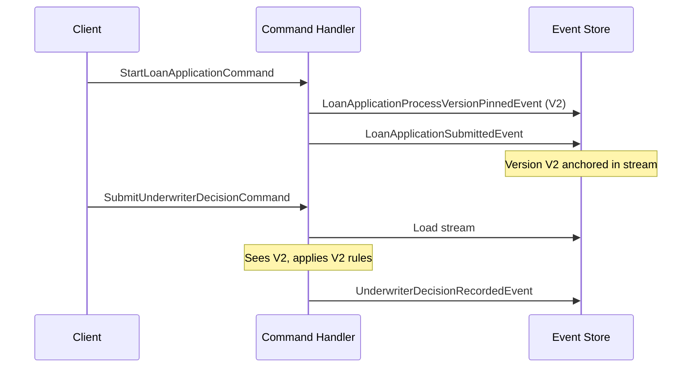
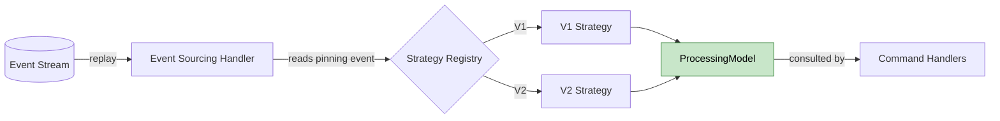

# Dealing With Business Process Evolution - Versioning Business Logic in Event-Sourced Systems

Modern software does not just store data. It orchestrates business processes - approvals, fulfillments, onboarding flows - and these processes evolve. Regulations change, policies tighten, new approval steps appear, old thresholds shift. The code you wrote six months ago no longer represents the rules your business operates under today.

In the first article of this series, **[Evolving Event-Sourced Systems](../2026-05-11-evolving-event-sourced-systems/index.md)**, I covered three strategies for dealing with schema evolution - calculating missing data through upcasting, compensating with sensible defaults, and enriching lazily. These approaches share a common assumption: the change is about data shape. New field appears, old events do not carry it, you bridge the gap at read time.

But what if the change is not about data, but about behavior? What if your loan approval process used to need one underwriter and now needs two? What if a regulatory body added a disclosure step that must happen at the moment an application is submitted? You cannot upcast your way out of this. The events from last month are still factually correct - they just happened under different rules.

This is where process version pinning enters the picture. Instead of trying to bend old events into new shapes, you record which version of the rules each process started under, and let every instance run to completion under its own pinned version. The event store stays immutable, the rules can evolve freely, and in-flight work finishes the way it began. That is the mechanism this article unpacks.

<!-- more -->

!!! abstract "System Evolution & Business Logic series"
    - [Part 1: Evolving Event-Sourced Systems](../2026-05-11-evolving-event-sourced-systems/index.md) — schema evolution
    - **Part 2: Dealing With Business Process Evolution** — versioning business logic *(you are here)*

## Why Schema-Evolution Strategies Stop Here

**[Upcasting](../../../../concepts/upcasting/index.md)** is a data transformation. It takes an event written under an older schema and produces a representation that matches the current code's expectations - new fields appear, optional ones get populated, structures get reshaped. What upcasting cannot do is change which code runs when the transformed event is replayed. The behavior on top of the data is determined by the application logic, not by the events themselves.

Lazy enrichment goes one step further by writing new events to the stream when something is missing. But even there, the missing piece is data. The enrichment fills in what was never recorded, so that the next command can find the field it needs. If the rule itself has changed - if the very logic of "what counts as an approved loan" has shifted - enrichment does not help, because there is no field to add. There is a new decision policy to apply, and that policy lives in code, not in events.

Consider a concrete case. Your loan approval process required a single underwriter signature regardless of loan volume. Six months later, regulation tightens: loans above 100,000 euros now require two independent underwriters and a regulatory disclosure sent to the applicant at the moment of submission. An application of 200,000 euros submitted three weeks ago is still in flight.

The team's instinct is "let us just collect a second signature and continue" - but the disclosure that should have been sent at submission was never sent, because at that time the rule did not exist. You cannot pretend it happened. The version a process started under is not just a label - it is the contract under which the process must complete.

??? warning "Why missed process steps cannot be backfilled"
    A skipped notification, an unrecorded approval, or a missing audit entry is not "data that needs to be added later" - it is a step in a regulated process that should have happened at a specific moment. Sending the disclosure today does not satisfy a rule that required it at submission time. The clean path here is to honor the version the process started under - because the disclosure cannot be reconstructed retroactively. Not every rule change is this strict, and the mechanism that lets you make this judgment per instance is the topic of the next section.

## What Pinning Actually Buys You - Per-Instance Choice

The disclosure example illustrates the strictest case: a missing step that cannot be reconstructed, so the running instance must finish under the old rules. But "finish under the old rules" is one of several legitimate outcomes, not the only one. The deeper value of pinning is that it lets you decide *per instance* rather than *per system*.

At the moment a rule changes, your system holds three categories of process instances:

| Category | What pinning gives you |
|---|---|
| **Completed** | A replay-stable record of which rules governed each historical run - so an audit five years from now produces the same outcome it did when the process finished |
| **Running** | A per-instance choice: finish under the old rules, or deliberately migrate to the new ones - both are legitimate, but the decision is yours to make and to document |
| **New** | An automatic pickup of the latest version, captured at the very first command |

Not every rule change is as absolute as the disclosure example. A relaxed credit threshold, a renamed status, a new optional check - these can often be applied safely to running instances. Without pinning, this is a system-wide gamble: the moment you deploy the change, every running process suddenly behaves differently. With pinning, the same change becomes an instance-by-instance decision, informed by the version each instance is currently running under. Pinning does not pick between "freeze" and "migrate" - it gives you the information to make either choice deliberately, at the granularity that matters.

## Pinning the Version - The Event as Anchor

The mechanism is straightforward. At the moment a process starts - typically the first meaningful command on a new instance - you emit a special event that records which version of the process applies to this particular run. From then on, that version is part of the instance's history, written into the **[event stream](../../../../concepts/events/index.md)** alongside the business events. When you replay the stream years later, the version is right there with the rest of the facts.

Here is what the event and its emission look like for a loan application. The handler resolves which version applies right now, then writes both the pinning event and the business event in one step. The version becomes part of the stream from the very first write, indelible and replay-stable.

??? note "About the code examples"
    The snippets in this article are condensed for clarity, not for direct copy-paste. In real OpenCQRS code, events are published through the framework's **[command handler](../../../../reference/extension_points/command_handler/index.md)** API rather than returned as a `List<Event>` from a function. The mechanics - what the handler decides, what gets persisted, in what order - are the same; the syntactic ceremony is left out so the patterns stand on their own.

```kotlin
data class LoanApplicationProcessVersionPinnedEvent(
    val applicationId: ApplicationId,
    val processVersion: String,
)

class StartLoanApplicationHandler(
    private val versionResolver: LoanProcessVersionResolver,
) {

    fun handle(command: StartLoanApplicationCommand): List<Event> {
        val version = versionResolver.resolveLatest()
        return listOf(
            LoanApplicationProcessVersionPinnedEvent(
                applicationId = command.applicationId,
                processVersion = version,
            ),
            LoanApplicationSubmittedEvent(
                applicationId = command.applicationId,
                amount = command.amount,
                applicantId = command.applicantId,
            ),
        )
    }
}
```

Notice what is and is not specified here. The resolver decides which version applies - but how it decides is intentionally left open. It might query a configuration value, look up the latest supported version, or accept a version from external input. The mechanism does not care. What matters is that the decision happens once, at the start, and the result is persisted as an event.

The sequence below illustrates how the pinning event anchors every subsequent command. Once the version is in the stream, every later command sees the same value when the instance is loaded. The replay rebuilds the same context, no matter when it runs.



The pinning event acts like an anchor at the start of the stream. Every command that follows, no matter how much time has passed, picks up the same version when the instance is loaded. The application running under version 2 today will still run under version 2 in five years - even if the system has long moved on to version 5.

??? info "What makes this work mechanically"
    The pinning event is just an event - same persistence, same ordering, same replay behavior as any other domain event. There is no special storage, no separate "version table", no out-of-band lookup at runtime. The version travels with the instance because it is part of the instance's history.

## Strategy-per-Version - A Complete Ruleset Per Variant

Knowing which version applies is only half the picture. The other half is what each version actually does. The cleanest way to model this is as a strategy (1) - one interface, one implementation per version, each implementation a complete statement of how this version behaves. No conditionals scattered across business handlers, no feature flags toggling individual rules. The version is the strategy.
{ .annotate }

1.  The classic Strategy design pattern from Gang of Four - a family of algorithms encapsulated behind a single interface, selected at runtime. The familiar use case is swappable sorting or compression algorithms; here the selection happens once at process start and stays fixed for the instance's lifetime.

Here is the loan approval process modeled this way. Version 1 represents the original single-underwriter rule across all loan volumes. Version 2 enforces the new dual-underwriter requirement and the regulatory disclosure step for high-value loans.

```kotlin
interface LoanApprovalProcess {
    fun submissionEvents(application: LoanApplication): List<Event>
    fun isApprovalComplete(signatureCount: Int, amount: Money): Boolean
}

class LoanApprovalProcessV1 : LoanApprovalProcess {

    override fun submissionEvents(application: LoanApplication): List<Event> =
        listOf(StandardAcknowledgementRequestedEvent(application.applicantId))

    override fun isApprovalComplete(signatureCount: Int, amount: Money): Boolean =
        signatureCount >= 1
}

class LoanApprovalProcessV2 : LoanApprovalProcess {

    override fun submissionEvents(application: LoanApplication): List<Event> {
        val ack = StandardAcknowledgementRequestedEvent(application.applicantId)
        return if (application.amount > Money.of(100_000)) {
            listOf(ack, RegulatoryDisclosureRequestedEvent(application.applicantId))
        } else {
            listOf(ack)
        }
    }

    override fun isApprovalComplete(signatureCount: Int, amount: Money): Boolean {
        val required = if (amount > Money.of(100_000)) 2 else 1
        return signatureCount >= required
    }
}
```

Each implementation is a complete picture of what that version of the process expects. V1 knows nothing about thresholds, dual signatures, or regulatory disclosures - those concepts did not exist when V1 was written. V2 knows them, and applies them with its own logic. When a new version arrives, you add a new class; you do not edit the old ones, because the old ones are still in production.

??? tip "Keep the strategy interface narrow"
    The interface is the part of this design that risks aging poorly. Every method on it must be implemented by every version - including V1, which knew nothing about the concepts later versions introduce. If V5 needs a new method that V1 has no meaningful answer for, V1 either grows a no-op default that misrepresents its semantics, or you end up with version-specific sub-interfaces that re-introduce the type checks the strategy was meant to eliminate.

    The practical mitigation, seen in production codebases applying this pattern, is to keep the interface small and push complexity into the implementations themselves. A strategy with three or four cohesive methods absorbs evolution gracefully; one with a dozen rule-specific predicates becomes a maintenance burden after the third version. When a new version needs a genuinely new concept, prefer adding one well-chosen method over many narrow ones - and prefer defaults that honestly express "this version does not participate in this concept" over fabricated answers.

The bridge between the pinning event and the chosen strategy lives in the **[event sourcing handler](../../../../reference/extension_points/state_rebuilding_handler/index.md)**, which reconstructs both the version and the strategy when the instance is replayed.

```kotlin
data class ProcessingModel(
    val processVersion: String,
    val strategy: LoanApprovalProcess,
)

class LoanApplicationInstance {

    var processingModel: ProcessingModel? = null

    fun on(event: LoanApplicationProcessVersionPinnedEvent) {
        processingModel = ProcessingModel(
            processVersion = event.processVersion,
            strategy = LoanApprovalProcessRegistry.forVersion(event.processVersion),
        )
    }
}
```

The handler runs during replay, so every time the instance is loaded, it picks the right strategy automatically. The registry maps a version string to the corresponding strategy instance. New versions extend the registry; old ones never disappear from it, because old applications still depend on them. The instance never has to know how to choose - the event told it which one to use long ago.



A reasonable question at this point: why not use a feature flag? Feature flags flip the behavior of the entire system at once - the moment you switch the flag, every running process suddenly behaves under the new rules. That is precisely what you want to avoid. Pinning is per instance. Each loan application carries its own version through to completion, regardless of what newer applications use.

??? tip "When to add a new strategy version"
    A new version is justified when the rule change is observable at the process boundary - a new required step, a different threshold, a new required side effect. Internal refactorings of existing logic do not need a new version; they just modify the existing strategy class. The rule of thumb: if existing instances must finish under the old behavior, you need a new version. If they should pick up the change immediately, you do not.

## Putting It Together - Commands Through a Pinned Process

With pinning and strategies in place, the rest of the application becomes refreshingly boring. Business **[command handlers](../../../../reference/extension_points/command_handler/index.md)** simply consult the processing model (1) that the instance has already reconstructed for itself. They do not check versions, they do not encode rule sets - they call methods on the strategy and let its answers drive what comes next. The polymorphism does the heavy lifting.
{ .annotate }

1.  The processing model is the in-memory state representation built up by the event sourcing handlers during replay. In OpenCQRS, this is the typed object that the command handler receives as its current state argument - the result of feeding all prior events through the state-rebuilding handlers.

Here is what an underwriter-decision handler looks like once the strategy is in place. It does not know or care which version applies - it asks the strategy whether the approval is complete and dispatches its output events on the answer. Everything version-specific lives behind the strategy interface.

```kotlin
class SubmitUnderwriterDecisionHandler {

    fun handle(
        command: SubmitUnderwriterDecisionCommand,
        instance: LoanApplicationInstance,
    ): List<Event> {
        val strategy = instance.processingModel?.strategy
            ?: error("Process not initialized")

        val totalSignatures = instance.signatures.size + 1

        val decision = UnderwriterDecisionRecordedEvent(
            applicationId = command.applicationId,
            underwriterId = command.underwriterId,
        )
        return if (strategy.isApprovalComplete(totalSignatures, instance.amount)) {
            listOf(decision, ApprovalCompletedEvent(command.applicationId))
        } else {
            listOf(decision)
        }
    }
}
```

There is still a branch in the handler - the `if/else` that decides whether to emit `ApprovalCompletedEvent` alongside the decision. The point is what the branch dispatches on: not a version string, not a hand-rolled comparison of signature counts against version-specific thresholds, but the strategy's own answer to "is this approval complete now?". Adding V3 with three underwriters, V4 with a cooling-off window, or V5 with regional diversity requirements does not change this handler. The strategy interface is the boundary - the if/else lives on the dispatch side, not the rule side.

The same insulation principle applies at the start of the process. The original `StartLoanApplicationHandler` only wrote the pinning event and the submission event - but now that the strategy owns which events mark a submission under its version, the handler defers that decision to it. The version is resolved as before, the strategy is retrieved from the registry, and its `submissionEvents(...)` answer is appended directly to the event list.

```kotlin
class StartLoanApplicationHandler(
    private val versionResolver: LoanProcessVersionResolver,
    private val strategyRegistry: LoanApprovalProcessRegistry,
) {

    fun handle(command: StartLoanApplicationCommand): List<Event> {
        val version = versionResolver.resolveLatest()
        val strategy = strategyRegistry.forVersion(version)

        val application = LoanApplication(
            applicationId = command.applicationId,
            amount = command.amount,
            applicantId = command.applicantId,
        )

        return buildList {
            add(LoanApplicationProcessVersionPinnedEvent(command.applicationId, version))
            add(LoanApplicationSubmittedEvent(command.applicationId, command.amount, command.applicantId))
            addAll(strategy.submissionEvents(application))
        }
    }
}
```

Whether a submission emits one acknowledgement event or also a disclosure event is not a decision this handler makes - it is a decision encoded in whichever strategy the resolver picked. V1 returns one event, V2 returns one or two depending on the amount, and a future V3 might return something else entirely. The handler stays the same.

??? info "Events are the boundary, not side effects"
    A subtle but important point: the strategy returns *events*, not *side effects*. In OpenCQRS, **[command handlers](../../../../reference/extension_points/command_handler/index.md)** are expected to be free of side effects - they decide which events to write, and downstream **event handlers** react to those events to perform real-world actions like sending the disclosure email. By having the strategy speak in events, the versioned policy stays inside the command-handling layer where it belongs, and the side effects themselves remain a separate concern driven by whichever handlers subscribe to `RegulatoryDisclosureRequestedEvent`. The version determines which events get written; the events determine what eventually happens.

### The Layering That Makes It Work

The cleaner way to state why this pattern holds up is a layering that CQRS already invites. Command handlers exist to enforce business invariants and to dispatch the right state-changing events. They ask **status-level questions**: "is this approval complete?", "is the applicant still eligible?", "is this loan application in a state that accepts new signatures?". Strategies exist to answer those questions with **versioned policy** - the mechanics that turn process facts into status answers. They own "how many signatures count as complete", "which events mark a submission", "what disqualifies an applicant".

Consider the alternative: a strategy that exposes `requiredSignatures(amount)` and a handler that does `totalSignatures >= required` itself. That layering would be broken. The strategy would return a threshold, and the handler would encode the rule that compares against it - so the handler would partly know the policy. The line would be fuzzy, and every new version that changed *how* completeness is decided (a quorum rule, a cooling-off window, a regional diversity check) would force the handler to learn the new shape of the comparison. With `isApprovalComplete` behind the strategy interface, the line is clean: the handler queries an invariant, the strategy supplies the answer that determines it. Two roles, two layers, no overlap.

### Why Evolution Becomes Predictable

From this layering, the practical payoff follows automatically. **Version-specific change concentrates in the policy layer.** New strategy classes, registry entries, occasional resolver wiring - these are the places where versioning lives. It stops leaking into handlers, projections, validators, and side-effect emitters that consume the strategy's answers without needing to know how they were produced.

This is the real value proposition of the pattern, and it deserves stating directly: **the pattern does not make process evolution free - it makes the cost predictable and localized.** Adding a fifth version means writing one new strategy implementation and registering it. It does not mean auditing thirty command handlers for hidden version assumptions, hunting down stale thresholds in projections, or wondering which downstream piece of code silently depends on the old behavior. Versioning becomes a thing that happens in known places, not a smell that spreads.

## When More Than One Model Evolves at Once

The pattern shown so far pins a single thing: the process version. Real systems rarely stay that simple. A loan approval process tends to coexist with a document model (the layout and content of the regulatory disclosure), a task structure (the work items underwriters see in their queue), and a calculation policy (how risk and effective interest are computed). Each of these evolves on its own schedule, driven by different teams and different external pressures. A compliance update to the disclosure form should not have to wait for the next process release; a new risk model should ship without re-versioning the workflow.

The pinning mechanism extends to this without changing shape. Instead of pinning each model independently and risking inconsistent combinations, you pin the process version and let a small compatibility mapping translate it into a coherent bundle: process V2 implies document V3, task structure V2, calculation policy V5 - the numbers do not need to line up, because each axis evolves on its own. The event in the stream stays a single anchor. The mapping lives next to the strategy registry, and the event sourcing handler that hydrates the in-memory model on replay picks all the right pieces at once.

The payoff is the same as for the single-model case, but compounding. An application started under process V2 keeps the entire world it began in - the rules it was decided by, the form it was disclosed with, the tasks it generated, the interest it was quoted - even years later, even as each model behind it has drifted independently. The pin freezes a coordinate in a multidimensional version space, not a single number.

## What You Have Learned

Schema evolution and process evolution look similar from a distance, but they require different tools. The strategies in the first article - upcasting and lazy enrichment - bend stored data into the shape today's code expects. They work because the change is one of representation, not of behavior. When the change is behavioral, when the rules themselves shift, you need a mechanism that records which rules applied, not which fields existed.

Pinning is that mechanism. You write the version into the event stream at process start, you let each instance carry its own pinned version forever, and you model each version as a complete strategy that knows its own rules. The event store remains immutable, the rules evolve freely in code, and instances finish under the rules they began with - unless you deliberately migrate them.

The deeper reason this works is a layering that CQRS already encourages but rarely makes explicit: command handlers enforce invariants and ask status-level questions, strategies encode the versioned policies that answer them. When that line is drawn cleanly, version-specific change concentrates in the policy layer and stops leaking into handlers, projections, and side-effect emitters. Evolution costs do not disappear, but they become predictable, localized, and bounded by the size of one new strategy implementation.

The deeper lesson is the same across both articles in this series. The event store is the ground truth, and everything else - schemas, rules, strategies - adapts around it. You do not migrate the events; you give the application the tools to honor what the events recorded. Pinning is the tool when the rules are what changed.

*[event store]: The append-only persistence layer storing all domain events as the single source of truth
*[event sourcing]: A persistence pattern that stores all state changes as an immutable sequence of events rather than overwriting current state
*[instance]: A stateful entity in OpenCQRS whose current state is reconstructed by replaying its events
*[pinning]: Recording a process version as an event at the start of an instance's lifecycle, freezing the rules that apply to that instance
*[process version]: An identified snapshot of business rules and process logic, pinned to a specific instance for the duration of its lifecycle
*[strategy]: A polymorphic implementation of version-specific behavior, with one implementation per version sharing a common interface
*[event sourcing handler]: A function invoked during event replay that updates the in-memory state of an instance based on a specific event type
*[command handler]: A function that receives a command, loads the current state, applies business rules, and publishes new events
*[feature flag]: A configuration switch that toggles behavior across the entire system, in contrast to per-instance version pinning
