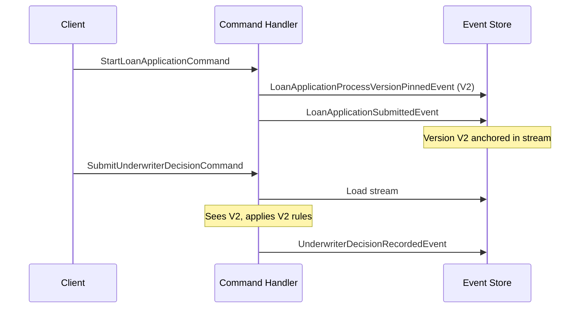
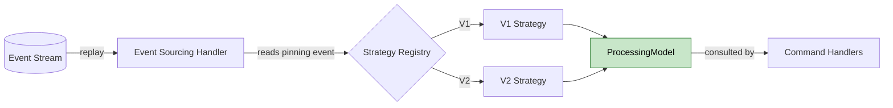

# Dealing With Business Process Evolution - Versioning Business Logic in Event-Sourced Systems

Modern software does not just store data. It orchestrates business processes - approvals, fulfillments, onboarding flows - and these processes evolve. Regulations change, policies tighten, new approval steps appear, old thresholds shift. The code you wrote six months ago no longer represents the rules your business operates under today.

In the first article of this series, **[Evolving Event-Sourced Systems](../2026-05-11-evolving-event-sourced-systems/index.md)**, I covered three strategies for dealing with schema evolution - calculating missing data through upcasting, compensating with sensible defaults, and enriching lazily. These approaches share a common assumption: the change is about data shape. New field appears, old events do not carry it, you bridge the gap at read time.

But what if the change is not about data, but about behavior? What if your loan approval process used to need one underwriter and now needs two? What if a regulatory body added a disclosure step that must happen at the moment an application is submitted? You cannot upcast your way out of this. The events from last month are still factually correct - they just happened under different rules.

This is where process version pinning enters the picture. Instead of trying to bend old events into new shapes, you record which version of the rules each process started under, and let every instance run to completion under its own pinned version. The event store stays immutable, the rules can evolve freely, and in-flight work finishes the way it began. That is the mechanism this article unpacks.

<!-- more -->

## Why Schema-Evolution Strategies Stop Here

**[Upcasting](../../../../concepts/upcasting/index.md)** is a data transformation. It takes an event written under an older schema and produces a representation that matches the current code's expectations - new fields appear, optional ones get populated, structures get reshaped. What upcasting cannot do is change which code runs when the transformed event is replayed. The behavior on top of the data is determined by the application logic, not by the events themselves.

Lazy enrichment goes one step further by writing new events to the stream when something is missing. But even there, the missing piece is data. The enrichment fills in what was never recorded, so that the next command can find the field it needs. If the rule itself has changed - if the very logic of "what counts as an approved loan" has shifted - enrichment does not help, because there is no field to add. There is a new decision policy to apply, and that policy lives in code, not in events.

Consider a concrete case. Your loan approval process required a single underwriter signature regardless of loan volume. Six months later, regulation tightens: loans above 100,000 euros now require two independent underwriters and a regulatory disclosure sent to the applicant at the moment of submission. An application of 200,000 euros submitted three weeks ago is still in flight.

The team's instinct is "let us just collect a second signature and continue" - but the disclosure that should have been sent at submission was never sent, because at that time the rule did not exist. You cannot pretend it happened. The version a process started under is not just a label - it is the contract under which the process must complete.

??? warning "Why missed process steps cannot be backfilled"
    A skipped notification, an unrecorded approval, or a missing audit entry is not "data that needs to be added later" - it is a step in a regulated process that should have happened at a specific moment. Sending the disclosure today does not satisfy a rule that required it at submission time. The clean path is to honor the version the process started under, and to let the new rules apply only to processes that began after the change.

## Pinning the Version - The Event as Anchor

The mechanism is straightforward. At the moment a process starts - typically the first meaningful command on a new instance - you emit a special event that records which version of the process applies to this particular run. From then on, that version is part of the instance's history, written into the **[event stream](../../../../concepts/events/index.md)** alongside the business events. When you replay the stream years later, the version is right there with the rest of the facts.

Here is what the event and its emission look like for a loan application. The handler resolves which version applies right now, then writes both the pinning event and the business event in one step. The version becomes part of the stream from the very first write, indelible and replay-stable.

```kotlin
data class LoanApplicationProcessVersionPinnedEvent(
    val applicationId: ApplicationId,
    val processVersion: String,
)

class StartLoanApplicationHandler(
    private val versionResolver: LoanProcessVersionResolver,
) {

    fun handle(command: StartLoanApplicationCommand): List<Event> {
        val version = versionResolver.resolveLatest()
        return listOf(
            LoanApplicationProcessVersionPinnedEvent(
                applicationId = command.applicationId,
                processVersion = version,
            ),
            LoanApplicationSubmittedEvent(
                applicationId = command.applicationId,
                amount = command.amount,
                applicantId = command.applicantId,
            ),
        )
    }
}
```

Notice what is and is not specified here. The resolver decides which version applies - but how it decides is intentionally left open. It might query a configuration value, look up the latest supported version, or accept a version from external input. The mechanism does not care. What matters is that the decision happens once, at the start, and the result is persisted as an event.

The sequence below illustrates how the pinning event anchors every subsequent command. Once the version is in the stream, every later command sees the same value when the instance is loaded. The replay rebuilds the same context, no matter when it runs.



The pinning event acts like an anchor at the start of the stream. Every command that follows, no matter how much time has passed, picks up the same version when the instance is loaded. The application running under version 2 today will still run under version 2 in five years - even if the system has long moved on to version 5.

??? info "What makes this work mechanically"
    The pinning event is just an event - same persistence, same ordering, same replay behavior as any other domain event. There is no special storage, no separate "version table", no out-of-band lookup at runtime. The version travels with the instance because it is part of the instance's history.

## Strategy-per-Version - A Complete Ruleset Per Variant

Knowing which version applies is only half the picture. The other half is what each version actually does. The cleanest way to model this is as a strategy (1) - one interface, one implementation per version, each implementation a complete statement of how this version behaves. No conditionals scattered across business handlers, no feature flags toggling individual rules. The version is the strategy.
{ .annotate }

1.  The classic Strategy design pattern from Gang of Four - a family of algorithms encapsulated behind a single interface, selected at runtime. The familiar use case is swappable sorting or compression algorithms; here the selection happens once at process start and stays fixed for the instance's lifetime.

Here is the loan approval process modeled this way. Version 1 represents the original single-underwriter rule across all loan volumes. Version 2 enforces the new dual-underwriter requirement and the regulatory disclosure step for high-value loans.

```kotlin
interface LoanApprovalProcess {
    fun requiredSignatures(amount: Money): Int
    fun submissionSideEffects(application: LoanApplication): List<SideEffect>
}

class LoanApprovalProcessV1 : LoanApprovalProcess {

    override fun requiredSignatures(amount: Money): Int = 1

    override fun submissionSideEffects(application: LoanApplication): List<SideEffect> =
        listOf(SendStandardAcknowledgement(application.applicantId))
}

class LoanApprovalProcessV2 : LoanApprovalProcess {

    override fun requiredSignatures(amount: Money): Int =
        if (amount > Money.of(100_000)) 2 else 1

    override fun submissionSideEffects(application: LoanApplication): List<SideEffect> {
        val ack = SendStandardAcknowledgement(application.applicantId)
        return if (application.amount > Money.of(100_000)) {
            listOf(ack, SendRegulatoryDisclosure(application.applicantId))
        } else {
            listOf(ack)
        }
    }
}
```

Each implementation is a complete picture of what that version of the process expects. V1 knows nothing about thresholds, dual signatures, or regulatory disclosures - those concepts did not exist when V1 was written. V2 knows them, and applies them with its own logic. When a new version arrives, you add a new class; you do not edit the old ones, because the old ones are still in production. The bridge between the pinning event and the chosen strategy lives in the **[event sourcing handler](../../../../reference/extension_points/state_rebuilding_handler/index.md)**, which reconstructs both the version and the strategy when the instance is replayed.

```kotlin
data class ProcessingModel(
    val processVersion: String,
    val strategy: LoanApprovalProcess,
)

class LoanApplicationInstance {

    var processingModel: ProcessingModel? = null

    fun on(event: LoanApplicationProcessVersionPinnedEvent) {
        processingModel = ProcessingModel(
            processVersion = event.processVersion,
            strategy = LoanApprovalProcessRegistry.forVersion(event.processVersion),
        )
    }
}
```

The handler runs during replay, so every time the instance is loaded, it picks the right strategy automatically. The registry maps a version string to the corresponding strategy instance. New versions extend the registry; old ones never disappear from it, because old applications still depend on them. The instance never has to know how to choose - the event told it which one to use long ago.



A reasonable question at this point: why not use a feature flag? Feature flags flip the behavior of the entire system at once - the moment you switch the flag, every running process suddenly behaves under the new rules. That is precisely what you want to avoid. Pinning is per instance. Each loan application carries its own version through to completion, regardless of what newer applications use.

??? tip "When to add a new strategy version"
    A new version is justified when the rule change is observable at the process boundary - a new required step, a different threshold, a new required side effect. Internal refactorings of existing logic do not need a new version; they just modify the existing strategy class. The rule of thumb: if existing instances must finish under the old behavior, you need a new version. If they should pick up the change immediately, you do not.

## Putting It Together - Commands Through a Pinned Process

With pinning and strategies in place, the rest of the application becomes refreshingly boring. Business **[command handlers](../../../../reference/extension_points/command_handler/index.md)** simply consult the processing model (1) that the instance has already reconstructed for itself. They do not check versions, they do not branch on rule sets, they just call methods on the strategy. The polymorphism does the heavy lifting.
{ .annotate }

1.  The processing model is the in-memory state representation built up by the event sourcing handlers during replay. In OpenCQRS, this is the typed object that the command handler receives as its current state argument - the result of feeding all prior events through the state-rebuilding handlers.

Here is what an underwriter-decision handler looks like once the strategy is in place. It does not know or care which version applies - it only knows that the strategy will tell it how many signatures are needed. Everything version-specific lives behind the strategy interface.

```kotlin
class SubmitUnderwriterDecisionHandler {

    fun handle(
        command: SubmitUnderwriterDecisionCommand,
        instance: LoanApplicationInstance,
    ): List<Event> {
        val strategy = instance.processingModel?.strategy
            ?: error("Process not initialized")

        val collected = instance.signatures.size + 1
        val required = strategy.requiredSignatures(instance.amount)

        val decision = UnderwriterDecisionRecordedEvent(
            applicationId = command.applicationId,
            underwriterId = command.underwriterId,
        )
        return if (collected >= required) {
            listOf(decision, ApprovalCompletedEvent(command.applicationId))
        } else {
            listOf(decision)
        }
    }
}
```

No version check, no if-chain on a process version string, no conditional path through the handler. The handler reads from the instance, asks the strategy, and emits the appropriate events. Adding a new version - V3 with three underwriters, or some entirely different approval workflow - requires no change here. The handler is permanently insulated from process evolution, because the evolution happens behind the strategy interface.

??? note "Where the savings show up"
    The payoff arrives slowly but compounds. Each new version adds one new class and one registry entry, and the existing command handlers stay untouched. After three or four versions, the cost of evolving the process is essentially the cost of writing a new strategy implementation - everything else is already wired.

## What You Have Learned

Schema evolution and process evolution look similar from a distance, but they require different tools. The strategies in the first article - upcasting and lazy enrichment - bend stored data into the shape today's code expects. They work because the change is one of representation, not of behavior. When the change is behavioral, when the rules themselves shift, you need a mechanism that records which rules applied, not which fields existed.

Pinning is that mechanism. You write the version into the event stream at process start, you let each instance carry its own pinned version forever, and you model each version as a complete strategy that knows its own rules. The event store remains immutable, the rules evolve freely in code, and instances finish under the rules they began with.

There is one direction this article does not explore, and it deserves a brief mention. In real systems, more than one model often evolves at once - a process version might pair with a specific document model, a specific task structure, or a specific calculation policy. The pinning mechanism extends naturally to compatibility mappings between co-evolving models: when V2 of the process is pinned, V3 of the document set is what comes with it. That is a topic for a future article in this series.

The deeper lesson is the same across both articles in this series. The event store is the ground truth, and everything else - schemas, rules, strategies - adapts around it. You do not migrate the events; you give the application the tools to honor what the events recorded. Pinning is the tool when the rules are what changed.

*[event store]: The append-only persistence layer storing all domain events as the single source of truth
*[event sourcing]: A persistence pattern that stores all state changes as an immutable sequence of events rather than overwriting current state
*[instance]: A stateful entity in OpenCQRS whose current state is reconstructed by replaying its events
*[pinning]: Recording a process version as an event at the start of an instance's lifecycle, freezing the rules that apply to that instance
*[process version]: An identified snapshot of business rules and process logic, pinned to a specific instance for the duration of its lifecycle
*[strategy]: A polymorphic implementation of version-specific behavior, with one implementation per version sharing a common interface
*[event sourcing handler]: A function invoked during event replay that updates the in-memory state of an instance based on a specific event type
*[command handler]: A function that receives a command, loads the current state, applies business rules, and publishes new events
*[feature flag]: A configuration switch that toggles behavior across the entire system, in contrast to per-instance version pinning
