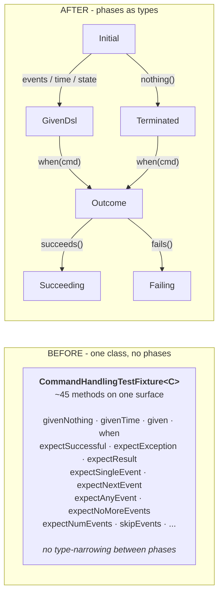
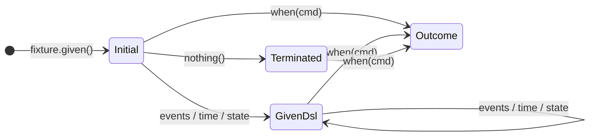

# We Tried to Delete `expect`. We Got a New Test DSL Instead.

Refactors rarely arrive at the door announcing themselves. Most of them sneak in through small annoyances - a method name that grates, a prefix that feels redundant, a chain of calls that reads worse on the third skim than on the first. Someone files a quick cleanup ticket. Two weeks later, three thousand lines of diff sit in a pull request and nobody is quite sure when it stopped being a cleanup.

That is the story I want to tell about the OpenCQRS test API. The starting point was a small observation: every test method in our fixture began with `expect`, and that prefix was the visible tip of something structural we wanted to fix. We set out to extract the expect side of the API into its own concept. What we ended up doing was inventing a phase-typed DSL across the whole fixture, splitting one class into five, and rewriting the contract of `single()` twice.

Two lessons are threaded through that story. The first is about reading symptoms, because the visible problem is almost never the structural one, and treating a smell as cosmetic is how you fail to fix it. The second is about iteration, because good refactors of meaningful APIs do not land in one throw. They unfold over months and across multiple people.

<!-- more -->

## We Just Wanted to Delete `expect`

Here is what triggered the refactor. Every test in our suite looked the same way at the bottom: a stack of method calls, each starting with the same five letters. The redundancy was loud enough that you noticed it before you noticed what the tests were actually doing.

```java
fixture.givenNothing()
    .when(new BorrowBookCommand(bookId, readerId))
    .expectSuccessfulExecution()
    .expectSingleEvent(new BookBorrowedEvent(bookId, readerId))
    .expectNoMoreEvents();
```

The prefix was obviously a symptom rather than noise. We knew that going in. The plan was straightforward enough to start: extract the expect side of the API into its own type, give it the identity the prefix had been substituting for, and let the assertion methods hang off it. The moment we started sketching that extraction, the plan grew. If we gave the expect phase a proper home but left the setup phase scattered across the **[fixture](../../../../reference/test_support/command_handling_test_fixture/index.md)**, we would only have moved the same structural smell to a different corner. **You cannot fix a phase model halfway.**

```java
fixture.given().nothing()
    .when(new BorrowBookCommand(bookId, readerId))
    .succeeds()
    .allEvents().exactly(new BookBorrowedEvent(bookId, readerId));
```

The `expect` is gone, not because we hunted it down but because the type system now carries the role the prefix used to carry. The fixture's `given()` returns a `GivenDsl`, `when()` returns an `ExpectDsl.Outcome`, and each transition narrows what the next method call can be. The structural fix paid the cosmetic debt as a side effect. If you only extract one phase, the rest of the API still leans on prefixes - the prefixes vanish only once every phase has a type.



The before-picture shows what you cannot fix with renames: a single class hosting setup, execution, and assertion all on the same surface. The after-picture shows what the compiler can now check for you. Phases become types, transitions become method signatures, and illegal paths become unreachable. Naming follows structure, not the other way around.

??? info "Where the fluent fixture lives in the docs"
    The story above is about how the test fixture got its current shape. If you want to see what it looks like in working code, the [Testing the Domain](../../../../tutorials/06_testing/index.md) tutorial walks through the API with real command handlers and assertions.

## Symptoms, Not Cosmetics

The `expect` story was not the only one of its kind. The old fixture had another tell that pointed at the same kind of structural smell - one we recognized for what it was, even if we did not yet see the full chain of consequences. We called it the `andGiven*` dialect.

In the original API, you could set the initial time-stamp two different ways. `fixture.givenTime(now)` worked when you wrote it as the first call. But once the fixture handed you back its `Given` object, the same operation was called `andGivenTime(later)` - same semantics, different name, depending on which class you were holding. We had `andGiven(events)`, `andGivenTimeDelta(duration)`, `andGivenCommand(...)`, all of them shadowing methods that existed on the fixture itself.

```java
fixture.givenTime(t)
    .andGiven(new BookAddedEvent(...))
    .andGivenTimeDelta(Duration.ofHours(1))
    .andGiven(new BookBorrowedEvent(...));
```

The prefix existed because the setup phase was represented by two different classes - the fixture itself and its `Given` inner type - and `and` was the disambiguator at call sites. It was a symptom of doubled phase identity, not a stylistic choice. Removing the prefix without removing the doubling would only have changed the symptom's shape. Once the phase became one interface, the doubling disappeared, and the prefix had nothing left to disambiguate.

```java
fixture.given()
    .time(t)
    .events(new BookAddedEvent(...))
    .timeDelta(Duration.ofHours(1))
    .events(new BookBorrowedEvent(...));
```

The new version reads cleaner because the structure now matches the phase. There is one `given()` call, and everything that configures the setup hangs off the single `GivenDsl` interface that comes back. The lesson generalizes well beyond this codebase. When you keep needing prefixes or qualifying words to keep methods from colliding, you are looking at a structural problem, not a naming one.

## Frank's Sketch Was Already There

One thing worth noticing is that the groundwork for the larger refactor was already in the repository before any of it started. The first commit that introduced an `ExpectDsl.java` file landed in June 2025. Sixty-six lines of sketch, written by my colleague Frank, with the commit message "draft for new test fixture expectation dsl." He had seen the central interface of the eventual rewrite and committed his version of it well before anyone planned to act on it.

The reason it sat for a while had nothing to do with pain accumulating or the surrounding code becoming ready. Other features needed shipping. Other refactors had stronger claims on attention. The draft was a quiet invitation, not a forcing function.

By the time the refactor got going, the seed was waiting. Frank's draft did not survive intact - by the time we were done, the interface had a different shape, more sub-types, and a different relationship to the fixture. The central idea was his, though, and the existence of the file made the conversation easier. You do not have to argue whether to extract an expect DSL when there is a sketch in the repository you can point at and ask what it should look like when it grows up.

??? tip "Why drafts deserve commits"
    A draft committed to a repository becomes a shared artifact - other contributors can find it, read it, and build on it without waiting for the author to remember to share. The alternative is keeping the idea in a private notebook or a one-off conversation, where it dies with attention. The cost of an early commit is essentially zero; the cost of an idea trapped in someone's head is much higher than it looks.

The lesson is uncomfortable for people who like clean planning. Good ideas often need a person with the context and the room to carry them, and there is no way to know in advance when those will line up. You write the sketch, you commit it, and you let it sit. The alternative is waiting until you have full clarity before committing anything, which means the idea lives only in your head where nobody else can build on it.

## When Runtime Guards Begged for the Type System

The next iteration story is about a single method. `nothing()` is what you call when your test scenario has no preconditions - no prior events, no initial state, fresh subject. It is one of the simplest methods in the DSL, and it gave us more design trouble than almost anything else.

The first version of `nothing()` was guarded at runtime. If you called it after you had already added events, it would throw. If you called it twice, it would throw. The implementation looked correct in isolation, but it left a smell every time we looked at it. Why does this DSL need to throw at runtime to prevent misuse?

The conversation about this with my colleague Benedikt is one I remember well. He pointed at the runtime check and said something close to "if the type system can express this, it should." That single sentence flipped the design. We split the entry interface into two (1): `Initial<C>` exposes `nothing()` along with the other setup methods, and `Terminated<C>` exposes only `when()`. Calling `nothing()` returns `Terminated`, which has no `events()` and no second `nothing()` on it.
{ .annotate }

1.  This is sometimes called the type-state pattern. It is common in Rust and Scala for modeling state machines, and increasingly used in modern Java codebases where sealed interfaces and return-type narrowing make it ergonomic.



The diagram shows the constraint visually. From `Initial`, you can configure or terminate. The moment you call any configurator, the type narrows from `Initial` to `GivenDsl`, which has no `nothing()` on it - so `.events(...).nothing()` becomes a compile error too, not only `.nothing().nothing()`. From `Terminated`, you can only execute. Nowhere on the graph can you add events after terminating, because the methods are simply not on the type.

The general principle is worth stating plainly. **When you reach for a runtime check in a DSL, ask whether the type system can express the same constraint.** Most of the time, it can. Interface splitting, return-type narrowing, and phantom types together cover a surprising amount of ground. Runtime guards are an admission that the API surface is too broad, usually because one interface is trying to represent two states.

??? tip "Compile-time DSL techniques"
    Three techniques carry most of the weight for type-driven DSLs. Interface splitting (as used here for `Initial` versus `Terminated`) restricts which methods are available at each phase. Return-type narrowing ensures that consuming methods like `succeeds()` return a different type than configuration methods. Phantom types push the same idea further by encoding state in generic parameters that have no runtime presence.

## A Method Name Is a Contract with the Reader

Not every iteration came from one round of design discussion. Sometimes a method name landed in the codebase, and only after other contributors looked at it did it become clear that the name and the implementation were saying different things. The most painful example was `single()`, and the disagreement over what it should mean ran for several passes before everyone was satisfied.

In the first version of the fluent API, `single()` meant "at least one of the captured events matches this validator." That is what the implementation did - it scanned the event list, looked for a match, and asserted that one existed. But internally, the team was never aligned on whether that was the right meaning. The disagreement was there from the moment the name and the implementation were proposed.

The contributors who pushed back made the same point from different angles. `single` reads as "there is exactly one event, and it matches" - the word carries the meaning "only one" too strongly to ignore. Well-known testing libraries (1) already use `single()` with exactly that strict meaning, and breaking from an established convention is a quiet way to confuse readers who carry expectations from other tools. So we flipped the contract.
{ .annotate }

1.  Examples include Kotlin's standard library `single()` extension on `Iterable`, AssertJ's `singleElement()` on collections, and similar single-element extractors elsewhere. All of them throw when there is not exactly one element - a strong precedent for the meaning we settled on.

`single()` is now strict: the stream must have length one, and that one event must match. To cover the cases the old `single` used to handle, we added three more methods. `once()` asserts that exactly one event in a stream of any length matches. `every()` asserts that all events match. `any()` asserts that at least one matches.

The implementation itself was straightforward; what took longer was settling the contract. A follow-up landed a few days after the initial commit, closing edge-case gaps that the new semantics exposed - what `single()` should do on an empty stream, what `every()` should do when there are no events at all. The whole episode took less than an hour to write code for and several days to settle into a shape everyone could agree on. **A method name is a contract with the reader, not with the author** - when the reader's interpretation differs from yours, the reader wins.

## What We Didn't Expect

When we started, the direction was clear and the size of the work was no surprise. Extract the expect phase, restructure the surrounding API for consistency, and let the type system carry the phases. The diff at merge tells the scale: the old fixture was 1697 lines, the new structure is 1192 lines in the fixture plus another 1049 lines across four new interface files. The test file grew from 3092 lines to 4529 lines, mostly because each phase now has its own dedicated tests.

Inside the fork, the work went through several rounds. The commit log shows three separate "feat: fluent test API refactor" entries, each one a do-over after review feedback. We never merged to main until the structure, the names, and the edge cases were settled and everyone involved was satisfied. By the time the fork landed, there was nothing left to argue about.

What could not be known up front was the specific shape the design would take. The interfaces, the narrowing returns, the method names; none of these existed in our heads at the start. They emerged through the work itself and through the disagreements about it. You can plan refactors of this kind in direction. You have to discover them in detail.

The meta-learnings compress to three habits. Read the symptoms before reaching for the fix - the visible problem is rarely the structural one. Expect iterations - the design you arrive at is rarely the one you draft. Listen to the contributors who push back on names and contracts; the reader's interpretation is the one that ships.

This is the first piece from a longer "How We Build OpenCQRS" series. There is a great deal more to tell about decisions, dead ends, and design choices that shaped the framework. The next entries will follow in their own time.

*[phase-typed DSL]: An API where each phase of an interaction is its own type, restricting which methods can be called at each step.
*[fluent DSL]: An API style where method calls chain into a sentence-like sequence, with each return type narrowing what can be called next.
*[fluent API]: An API style where method calls chain together into readable, sentence-like code.
*[CommandHandlingTestFixture]: The OpenCQRS test fixture for command handlers - replays events in memory, executes a command, captures emitted events, and exposes a fluent assertion DSL.
*[command handler]: An OpenCQRS extension point that consumes a command and emits events in response, encoding the business decision logic.
*[type-narrowing]: When a method's return type is more specific than its declaring interface, restricting what the caller can do next.
*[interface splitting]: A pattern where an interface is divided into multiple smaller interfaces, each representing a specific state or phase of an interaction.
*[phantom types]: Generic type parameters that have no runtime presence but encode state in the type system, used to enforce constraints at compile time.
