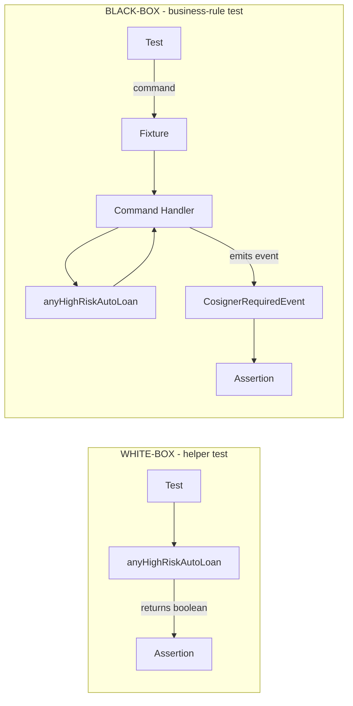

# Test the Business Rule, Not the Helper: Why Black-Box Testing Shines in Event-Sourced Systems

Every codebase has them. Helper functions that started as a few lines of conditional logic and grew into something that crosses a screen of code, threading through thresholds, cutoff dates, and a handful of sealed-class branches. They look important. They feel test-worthy. The instinct to wrap them in their own dedicated unit tests is almost automatic.

This article is about that instinct, and why following it tends to produce worse tests than the alternative. The alternative is black-box testing - asserting on the business outcome a system produces rather than the return value of the helper inside it. Most teams agree with black-box testing in principle and quietly abandon it in practice, usually for rational reasons that have nothing to do with discipline.

I want to look at the reasons, then look at one architecture where those reasons stop applying. The architecture is event sourcing. The lesson is not "use event sourcing." The lesson is what becomes possible when the boundary between input and output is something you can hold in your hand.

<!-- more -->

## The Helper That Begs for Tests

To make this concrete, picture a function that decides whether a loan application carries enough risk to require a cosigner. Picture it in a bank backend, because banks have rules with the right shape: numeric thresholds, regulatory cutoff dates, and a handful of loan types that behave differently from one another. Picture a method signature like `anyHighRiskAutoLoan(LoanRequest request)` returning a boolean.

The body of that method is not trivial. It walks the request's loans, filters to auto loans, and for each one checks whether the principal amount exceeds 50,000 EUR. If it does, it then checks whether the contract date falls after January 1st, 2024, because the regulation that introduced this check only applies to contracts signed after that date. Then it looks at the loan type, because `Loan.Refinance` and `Loan.Restructuring` follow slightly different rules than `Loan.Conventional`. Any matching loan makes the entire predicate true.

You can almost feel the testing pressure rising as you read that. The logic has at least six independent dimensions you could vary in tests - amount, date, type, count, mix, edge values at the threshold. The code is complex enough that you would want a safety net. Six dimensions usually means twenty to thirty test cases before you sleep well.

So the natural question becomes: what do you test? The shape of the helper suggests testing the helper. Six dimensions, three loan types, two boolean returns - obvious targets, obvious assertions. The question I want to push on is a different one: what is this helper actually for, and what does the caller do with the boolean it returns?

## What the Tests Look Like When You Give In

The first thing you write looks reasonable. A test class named `AnyHighRiskAutoLoanTest`, a handful of `@Test` methods, each constructing a `LoanRequest` and asserting `true` or `false`. One test for the threshold above 50,000 EUR. One for the threshold at exactly 50,000 EUR. One for the cutoff date, one before the cutoff date. Six dimensions, twenty cases. Coverage looks complete.

Then you sit back and ask yourself what these tests actually prove. They prove that `anyHighRiskAutoLoan(...)` returns the expected boolean for the expected inputs. That is, strictly, what the tests assert. Anything beyond that - whether the function is called, whether its result is used correctly, whether the resulting `CosignerRequired` field actually becomes mandatory in the user interface - is invisible to this test suite.

The system has at least three layers beyond the helper. There is the **[command handler](../../../../reference/extension_points/command_handler/index.md)** that consumes a `SubmitLoan` command and decides what events to emit. There is the precondition that wires the helper's boolean to the visibility of the cosigner field. There is the role check that decides whether the applicant or the underwriter has write access to that field. None of those are covered by helper tests.

If you ship a refactor that accidentally disconnects the helper from its caller, every test in `AnyHighRiskAutoLoanTest` still passes. **The helper is correct in isolation. The system is silently broken.** This is the structural deficiency of helper tests, and it does not disappear because the helper is complex.

## Same Inputs, Different Boundary

Now write the same tests at a different layer. Same `LoanRequest` inputs, same dimensions, same number of cases. The difference is where the assertion lands. Instead of calling the helper directly, the test submits a command to the system - the same command a user would submit through the UI - and asserts on what the system does in response.

In an **[event-sourced architecture](../../../../concepts/event_sourcing/index.md)**, the system reacts to commands by emitting events. A loan application that triggers the high-risk rule produces a `CosignerRequiredEvent`. A loan application that does not produces a different event or none at all. Both outcomes are observable as in-memory data, so the test can assert on them directly.

```java
@Test
void requires_a_cosigner_when_auto_loan_exceeds_50000_eur_after_cutoff() {
    fixture.given().nothing()
        .when(new SubmitLoanCommand(
            new Loan.Conventional(
                LoanKind.AUTO,
                BigDecimal.valueOf(50_001),
                LocalDate.of(2024, 1, 2)
            )
        ))
        .succeeds()
        .allEvents().any(e -> e.ofType(CosignerRequiredEvent.class));
}

@Test
void does_not_require_a_cosigner_when_auto_loan_is_at_threshold() {
    fixture.given().nothing()
        .when(new SubmitLoanCommand(
            new Loan.Conventional(
                LoanKind.AUTO,
                BigDecimal.valueOf(50_000),
                LocalDate.of(2024, 1, 2)
            )
        ))
        .succeeds()
        .allEvents().none(e -> e.ofType(CosignerRequiredEvent.class));
}
```

Read those two tests again and ask what they verify. They cover the helper's logic, the command handler's call site, the precondition wiring, and the event payload that lands in front of the assertion. Four layers, same number of cases, fewer lines of code. The white-box helper test covered only one of those four layers.

The structural difference is best seen visually. A helper test is a short rope between two points - the input you craft, the output you assert. A black-box test is a longer rope that wraps around more of the system before tying off. The picture is worth keeping in mind for the rest of the article.



The white-box test asserts on one return value. The black-box test asserts on what the user-facing system actually does in response to the same input. The second test costs the same to write and proves strictly more.

??? info "Decoding the fluent fixture syntax"
    Readers new to OpenCQRS may find the chained calls cryptic. `given().nothing()` declares no prior events. `.when(cmd)` runs the command. `.succeeds().allEvents().any(predicate)` asserts the command did not throw and that at least one captured event matches the predicate.

## Why This Becomes Cheap in This Architecture

If black-box tests are strictly better, why does anyone write helper tests at all? In most architectures, the answer is cost. To call a command handler in isolation, you usually have to construct a state to call it against, and constructing that state means setting up databases, repositories, mocks for external services, and a slice of the application context. The cheapest reasonable in-memory shortcut is some half-mocked variant that needs maintenance every time the layer below changes.

So teams settle. They write helper tests because they fit in a single file with no infrastructure. They tell themselves the integration tests will catch the wiring issues, and sometimes the integration tests do, and sometimes the wiring issues ship to production because the integration tests cover the happy path. The compromise is rational at the level of individual decisions and unfortunate at the level of the test suite.

Event-sourced architectures change the calculation. The boundary of a command handler is a small set of typed inputs - prior events and the new command - and a small set of typed outputs - new events, possibly a returned value. None of these require infrastructure. The fixture replays the prior events through **[state-rebuilding handlers](../../../../reference/extension_points/state_rebuilding_handler/index.md)** entirely in memory, runs the command, captures the emitted events, and lets you assert on them. The cost of a black-box test collapses to the cost of constructing a few records.

Once that collapse happens, helper tests stop being defensible. They cost roughly the same to write, cover strictly less of the system, and produce test names that read like internal documentation rather than user behavior. **The architecture is doing the work that mocks and fixtures used to do, and it is doing it for free.**

This is not a property unique to event sourcing in some metaphysical sense. Any architecture where the business-rule boundary can be expressed as pure data in and pure data out gets a version of this. Pure functional cores with imperative shells (1) get it. Hexagonal designs with disciplined ports get pieces of it. The reason event sourcing gets so much of it is that the architecture forces you to make the boundary explicit from day one - the events are the boundary, by construction.
{ .annotate }

1.  A design where pure business-logic functions are isolated from imperative I/O code. The pure core can be tested with simple inputs and outputs, much like a command handler in event sourcing - the surrounding shell handles persistence and external effects separately.

## Your Test Names Are the Tell

There is a quick diagnostic you can apply to any test suite today, regardless of which architecture it lives in. Look at the test names. Read them out loud. If the names sound like business requirements - "requires a cosigner when an auto loan exceeds 50,000 euro after the 2024 cutoff" - you are writing black-box tests. If the names sound like implementation notes - "testAnyHighRiskAutoLoanReturnsFalseAtThreshold" - you are writing white-box tests.

Both kinds of names have a place. Internal helpers that genuinely need verification, like parsers, validators, or formatters with their own complexity, deserve names that describe what they compute. The diagnostic only flags a problem when business-rule tests are mislabeled, which is what happens when you write helper tests for things that are not really helpers but business rules wearing a helper costume.

The most useful side effect of business-rule names is that they survive refactors. If you rename `anyHighRiskAutoLoan` to `requiresCosignerForAutoLoan`, the helper-named tests have to be renamed in lockstep, or they start lying. The business-rule named tests do not move. The system still requires a cosigner when an auto loan exceeds 50,000 euro after the cutoff, regardless of what the function inside the system is called this quarter.

The same principle runs one level deeper, into the assertion vocabulary itself. The fixture's terminal assertions are named for what a requirement would claim, not for how the check is implemented: `single()` asserts that there is exactly one event and that it matches, `once()` that exactly one event in a stream of any length matches, `every()` that all of them match, `any()` that at least one does, and `none()` that none do. Those verbs were made deliberately strict - `single` reads as "only one" the way it does in Kotlin's standard library or AssertJ, and the DSL honours that expectation rather than quietly redefining it. A method name is a contract with the reader, and that contract does not stop at the test's own name: the assertion you chain onto it should read as the outcome you meant, so the whole line - not just its label - states a business fact.

??? note "When helper tests still earn their keep"
    Not every helper is a business rule in disguise. Parsers, validators, formatters, and other utilities with their own intricate logic still benefit from direct tests - the test name `parsesIsoDateWithTrailingZulu` accurately describes what is being verified. The diagnostic flags a problem only when business outcomes are tested with helper-named tests, not when genuinely internal mechanics get their own coverage.

You can use the diagnostic before you change anything. Open your most-complex test file. Read three test names in a row. Ask yourself whether you could hand those three names to the person who wrote the business requirement and have them recognize their own work. If no, ask why - it might be the architecture making the right tests expensive, or it might just be habit, inertia, or a team decision that nobody has revisited in a while. The cause matters when you decide what to do about it; the architecture only sets the price, it does not write the tests for you.

## A Look at the Framework That Makes This Natural

For readers who have not seen **[OpenCQRS's test fixture](../../../../reference/test_support/command_handling_test_fixture/index.md)**, the snippets in section three may have looked unfamiliar. The fixture is a fluent DSL for testing command handlers in isolation: you describe the prior state in terms of events, submit a command, and assert on the outcome. The whole sequence is one chained expression that reads roughly like a Given-When-Then sentence written in Java.

```java
fixture.given()
    .events(new ApplicantOnboardedEvent(applicantId, "creditworthy"))
    .when(new SubmitLoanCommand(applicantId, new Loan.Conventional(...)))
    .succeeds()
    .allEvents().any(e -> e.ofType(CosignerRequiredEvent.class));
```

The DSL is not doing anything that could not be done with manual setup and assertions. It is doing what good DSLs do, which is making the natural test style cheaper to write than the unnatural one. Every chained method narrows the type (1) of what you can call next - setup methods return setup, the `when` call returns the outcome of the command, the success branch returns the assertion DSL, and so on. The shape of the test follows the shape of the business interaction.
{ .annotate }

1.  This phase typing - each phase of the interaction modelled as its own type - is the central design choice of the test DSL, and it is what makes the chain above the path of least resistance.

That fluency is not an accident of naming; it is the point of the design. The test API was built so that phases become types: `given()` hands back a setup type, `when()` narrows to the outcome of the command, and choosing `succeeds()` or `fails()` narrows again to the matching assertion surface. Transitions become method signatures, and illegal chains - setup after `when`, an assertion before you have committed to success or failure - simply do not compile. The effect is that the type system pushes developers toward business-rule tests and away from accidental helper tests: the natural chain to write is the one that submits a command and asserts on the emitted events.

If your stack is something other than OpenCQRS, the takeaway is not "switch frameworks." The takeaway is "calibrate your taste." This is the kind of fluency a test tool can offer when the architecture supports it. Whether your stack offers something similar is the question worth asking after you finish reading.

## Where This Leaves You

The pieces of the argument fit together in a small number of recommendations that survive outside event sourcing. Find the boundary in your architecture where the business outcome is observable, the point where what the user wanted to happen has either happened or not. Test at that boundary. Do not test below it, even when something below it looks complex enough to want its own tests.

If testing at that boundary is genuinely expensive in your architecture, do not just give up and write helper tests anyway. **Treat the expense as information.** Ask what makes it expensive (infrastructure, coupling, side effects in places they should not be) and ask whether you can change those things instead of changing your test strategy. A test suite is a downstream symptom of architectural choices. Trying to fix it without addressing the architecture rarely lasts.

??? warning "Beware the false economy of helper tests"
    Helper tests that pass while the system stays broken are worse than no tests at all - they project confidence that does not exist. If your suite is mostly helper tests for business rules, the green light it produces is informational noise, not a safety signal. The first refactor that exposes the gap usually does so in production.

Inside event sourcing, the cheap-boundary property is not a happy accident of any particular framework. It is the natural consequence of treating commands as the way change enters the system and events as the way it leaves. Frameworks like OpenCQRS make that consequence ergonomic, but the consequence exists with or without a particular framework. If your event-sourced project is still writing helper tests for business rules, the question is not whether the framework is helping you - it is whether you are letting it.

The natural follow-up, regardless of architecture, is how this kind of testing actually works mechanically without spinning up an event store. The fixture obviously cannot connect to a real database for every assertion - the cost would defeat the entire argument. The answer is a mechanism called the **[`StateRebuildingHandlerDefinition`](../../../../reference/extension_points/state_rebuilding_handler/index.md)**, which lets the fixture replay events through in-memory reducers to reconstruct state on demand. That mechanism deserves a closer look of its own.

*[black-box testing]: A testing approach that asserts on a system's observable outcomes rather than the internal implementation details that produce them.
*[white-box testing]: A testing approach that asserts on the return values or internal state of specific functions, with knowledge of how they are implemented.
*[fluent DSL]: An API style where method calls chain into a sentence-like sequence, with each return type narrowing what can be called next.
*[Given-When-Then]: A test structure that separates setup (given), action (when), and assertion (then) into distinct phases.
*[command handler]: An OpenCQRS extension point that consumes a command and emits events in response, encoding the business decision logic.
*[event-sourced architecture]: An architectural style where state changes are captured as an append-only log of events, and current state is derived by replaying that log.
*[state-rebuilding handlers]: OpenCQRS extension points that apply events to a state representation - in-memory reducers used by the test fixture to reconstruct state without an event store.
*[StateRebuildingHandlerDefinition]: The OpenCQRS construct that pairs a state type with the handlers that reduce events into it, used by the test fixture to reconstruct state in memory.
