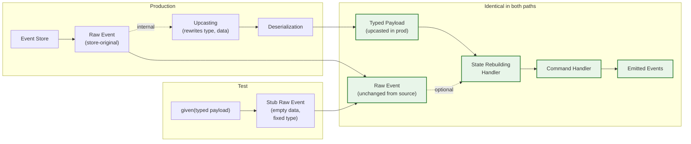

# Testing Command Handlers Without an Event Store - And Why That Is Enough

A library application has a rule that should never be wrong. You cannot return a book that nobody borrowed. So you write a test for it, and the test looks like this.

```java
@Test
public void cannotReturnBookThatWasNotBorrowed(
        @Autowired CommandHandlingTestFixture<ReturnBookCommand> fixture) {
    fixture.given()
            .events(new BookAddedEvent("isbn-9780261103252", "The Fellowship of the Ring"))
            .when(new ReturnBookCommand("isbn-9780261103252"))
            .fails()
            .throwing(BookNotBorrowedException.class);
}
```

No `@SpringBootTest`. No Testcontainers. No mocked event store, no in-memory database swapped in for the real one. The test runs in milliseconds, and it exercises the full behavior of the command handler - state reconstruction from the event history, the decision logic that examines the reconstructed state, and the error path that raises an exception when the rule is violated. Reading that, an honest skeptic asks the obvious question: how can this possibly be testing the real thing?

That tension is what this article works through. The skeptic's instinct is correct in most stacks: "no infrastructure" usually means "not the real thing", and the test is either fake-passing or only checking trivia. But in an event-sourced system built on OpenCQRS, the test you just saw is the real thing - from the only point that matters for behavior. This is the second piece in our **[How We Build OpenCQRS](../2026-07-06-we-tried-to-delete-expect/index.md)** series, and it tells the story of why that claim holds up under inspection.

<!-- more -->

## The Three Things You Want to Test

A **[command handler](../../../../reference/extension_points/command_handler/index.md)** is the place where every change to the system originates. When something needs to happen - a book gets added to the catalog, a reader borrows a title, a damaged copy comes back from circulation - a command arrives, the handler considers it, and either accepts it by emitting new events or rejects it by raising an exception. Behavior, in the strict sense, is the relationship between three things: the events that already happened, the command in front of you, and what the handler does about it.

Tests of behavior therefore need to cover three distinct surfaces. The first is **state reconstruction**: given a history of events, does the instance's current state come out right? The second is the **decision itself**: given that state plus an incoming command, does the handler emit the correct events with the correct payloads attached to the correct subjects? The third is **error behavior**: does the handler reject illegal commands cleanly, with the exceptions the domain expects?

A library example shows how the same **[fixture](../../../../reference/test_support/command_handling_test_fixture/index.md)** covers all three with the same DSL. Consider a book that has been added to the catalog and then borrowed once already. Now a second `BorrowBookCommand` arrives for the same copy.

```java
@Test
public void cannotBorrowABookAlreadyOut(
        @Autowired CommandHandlingTestFixture<BorrowBookCommand> fixture) {
    var anotherReader = UUID.randomUUID();

    fixture.given()
            .events(
                    new BookAddedEvent("isbn-1", "The Hobbit"),
                    new BookBorrowedEvent("isbn-1", UUID.randomUUID()))
            .when(new BorrowBookCommand("isbn-1", anotherReader))
            .fails()
            .throwing(BookAlreadyBorrowedException.class);
}
```

**Three behavioral claims are asserted in five lines.** The `.given().events(...)` clause asserts that state reconstruction will run correctly over those two events; the `.when(...)` clause asserts that the handler then evaluates the new command against the reconstructed state; the `.fails().throwing(...)` clause asserts that the rule violation surfaces as the right exception. No setup, no mocks for the business-rule decisions themselves, no infrastructure of any kind. (External dependencies of the command handler - read-model lookups, cross-instance existence checks, and other side queries - still get mocked the usual way; the fixture replaces only the event-sourced state machinery.) The next sections explain why that is not too good to be true.

## "Same Pipeline as Production" - What That Actually Means

The reflex of an experienced tester reading the snippet above is to assume the fixture is a clever substitute - an in-memory event store, perhaps, or a stubbed version of the **[state-rebuilding pipeline](../../../../reference/extension_points/state_rebuilding_handler/index.md)** that behaves "close enough" to production. That assumption is wrong, and the article hinges on the wrongness of it. The fixture does not replace any part of the system that matters for behavior. It replaces exactly one thing: the source of the events.

Look at what stays the same. In production, the framework reads a series of events from the event store, hands each one to the registered `StateRebuildingHandlerDefinition`s, accumulates the state, and then passes that state and the incoming command to the command handler. The fixture does precisely the same thing - same `StateRebuildingHandlerDefinition` instances (1), same accumulation logic, same command-handler invocation. The only substitution is that the events come from your `given(...)` clause instead of an event store query.
{ .annotate }

1.  Registered once via Spring auto-configuration (typically through `@StateRebuilding` annotations or explicit `StateRebuildingHandlerDefinition` beans), the fixture lifts them straight from the Spring context - literally the same JVM objects, same dependency graph.

A picture clarifies the line. The production pipeline and the test pipeline are best read as two paths that converge on a shared segment. What follows is the same flow, drawn so the convergence is visible.



The diagram is the load-bearing claim of the article. **Everything inside the shaded segment is the same code path in test and production.** Above that line, the two pipelines diverge in how they produce the typed payload: production reads the stored raw Event, runs an internal copy through upcasting to bring `type` and `data` to the current schema, and deserializes the upcasted form. The test hands the typed payload in directly. Below that line, the same handler code sees the same typed payload - optionally accompanied by the raw Event, which the framework passes through unchanged from its source: the store original in production, the stub raw Event in the test.

That is what "the fixture is production from the moment the typed payload arrives" means in practice. The line was drawn structurally, and you can point to where: at the boundary of the shaded segment in the diagram. The shortcut and the honesty are the same fact, seen from two sides.

## Two Views on the Same Event - Typed Payload and Raw Event

To see why that shared segment really is shared, look at what the **[State-Rebuilding Handler](../../../../reference/extension_points/state_rebuilding_handler/index.md)** actually receives. The variant that takes the raw event, `FromObjectAndRawEvent`, declares `on(I instance, E event, @Nullable Event rawEvent)` - two distinct event-related parameters (slimmer variants exist for handlers that don't need the raw Event). The first is the typed Java payload: your `BookAddedEvent` or `OrderPlacedEvent`, the domain view of what happened. The second is a raw `Event` record from the underlying store client, conforming to the CloudEvents spec and carrying identity and transport headers like `subject`, `id`, `time`, and a serialized `data` map. Two parameters, two complementary views of the same event.

!!! info "The two event parameters at a glance"
    - **`E event`** - the typed Java domain event (`BookAddedEvent`, `OrderPlacedEvent`, ...). Carries the domain content; this is what 99% of handler logic reads. In production it is the deserialized, upcasted result; in the test fixture it is the object you passed to `given(...)`.
    - **`Event rawEvent`** - the store-level record (`com.opencqrs.esdb.client.Event`). Carries identity and transport headers (`subject`, `id`, `time`, `source`, `data` map, hashes). `@Nullable` because it is only present when the event was read from the store - not during the publish path, where the event has just been emitted and has no store-side identity yet.

In production, the two views come from the same source by different paths. The framework reads the event's stored form once, and from that single source produces both: to get the typed payload, it runs an internal copy through any registered upcasters and then deserializes the upcasted `data` map into the typed Java class. The raw Event parameter handed to the handler, though, is *not* that upcasted intermediary - it is the store original, passed through unchanged. So a handler that reads `rawEvent.time()` gets the original publication moment; a handler that reads `rawEvent.data()` gets the map as originally written, even if the event has been upcasted three times in the meantime. For a `BookAddedEvent("isbn-1", "The Hobbit")` recently published and never upcasted, the raw Event passed to the handler looks like this.

```text
Event(
    source           = "library-service",
    subject          = "/books/isbn-1",
    type             = "library.book-added.v1",
    data             = { "isbn": "isbn-1", "title": "The Hobbit" },
    specVersion      = "1.0",
    id               = "evt-7a3f...",
    time             = 2025-06-08T10:30:00Z,
    dataContentType  = "application/json",
    hash             = "...",
    predecessorHash  = "..."
)
```

That `data` map is where your domain fields live in storage. To produce the typed payload, the framework picks the right Java class through `type` (running an internal copy through upcasters if registered), then decodes the upcasted `data` map according to `dataContentType`. Both views then flow into the handler - the typed payload as the primary `event` parameter, the raw Event as the optional `rawEvent`, still in its store-original form. In the test, the same handler must run the same way, but with no store, no serialization, and no upcasting in the picture.

```text
typed payload (the E event parameter):
    BookAddedEvent { isbn = "isbn-1", title = "The Hobbit" }

raw Event (the Event rawEvent parameter):
    Event(
        source           = "CommandHandlingTestFixture",
        subject          = "/books/isbn-1",      // from DSL or command
        type             = "test",                // hardcoded
        data             = {},                    // hardcoded empty
        specVersion      = "1.0",
        id               = "uuid-random",         // unless overridden via DSL
        time             = 2026-06-08T10:30:00Z,  // unless overridden via DSL
        dataContentType  = "application/test",
        hash             = "uuid-random",
        predecessorHash  = "uuid-random"
    )
```

The shape of the test inputs makes the design intent obvious. The typed payload carries the full domain content - `isbn`, `title`, and whatever else your event holds. The raw Event carries identity and transport headers that have nothing to do with the domain content. That split is the whole reason the handler signature has two parameters: domain content does not need to duplicate transport headers, and transport headers do not need to leak into your domain event classes. The handler picks what it actually needs from each.

One small detail completes the picture: the raw Event parameter is `@Nullable`. The replay path has a real raw Event from the store, so the parameter is filled. The publish path - where a command handler has just emitted a new event but it has not yet reached the store - has no raw Event yet, so the parameter is `null`. The framework could have invented placeholder values for `id`, `time`, and the hashes in the publish path, but that would have been the same kind of quiet lie the fixture itself refuses to tell. **Honest absence beats fabricated presence**, and the rule shows up in both places for the same reason.

??? tip "Deep Dive: Message vs. Event Terminology"
    In the Enterprise Integration Patterns vocabulary (Hohpe & Woolf, 2003), "Message" is a transport concept (payload + headers, agnostic of payload semantics) and "Event" is a semantic concept (a past fact with business meaning). An **Event Message** is a message whose payload is an event - exactly what OpenCQRS's `com.opencqrs.esdb.client.Event` is, structurally a CloudEvents-conformant Event Message. The name overlap with the typed Java domain event (`BookAddedEvent`, etc.) is why parameter names like `rawEvent` exist: verbal disambiguation between the typed payload and the surrounding record.

## The Honest Shortcut - Domain vs. Transport Attributes

Now zoom in on what the fixture actually allows you to set on that raw Event - and what it locks. The `EventSpecifierDsl` exposes exactly five fluent methods: `payload`, `subject`, `time`, `id`, and `metaData`. The other fields of the raw Event are filled in by the fixture itself, with no API for the user to override them. This selection is not an accident; it is the design rule this section unpacks.

Reading the construction code makes the rule concrete. The relevant slice from `CommandHandlingTestFixture.java` is small and worth reading carefully. The comments in the snippet map each constructor argument to its raw-event attribute.

```java
var rawEvent = new Event(
        CommandHandlingTestFixture.class.getSimpleName(),   // source
        event.subject() != null
                ? event.subject()
                : command().getSubject(),                    // subject
        "test",                                              // type
        Map.of(),                                            // data
        "1.0",                                               // specVersion
        event.id() != null
                ? event.id()
                : UUID.randomUUID().toString(),              // id
        event.time() != null ? event.time() : time(),        // time
        "application/test",                                  // dataContentType
        UUID.randomUUID().toString(),                        // hash
        UUID.randomUUID().toString());                       // predecessorHash
```

Half the fields are overridable, half are hardcoded, and the split is not arbitrary. The `EventSpecifierDsl` lets you set `subject`, `id`, `time`, and `metaData` per event - exactly the inputs a state-rebuilding handler may legitimately consult while folding events into state. A handler that stamps the latest update time onto the instance reads `time`; a handler that distinguishes events by subject reads `subject`; a handler that copies actor or correlation information into an audit field reads `metaData` (which the framework delivers as a separate handler parameter, not as a field on the raw Event). By making these overridable, the fixture lets you stub any input the handler is allowed to look at.

The other half is sealed because none of those fields could carry a useful test signal. `type`, `data`, and `dataContentType` exist only to drive deserialization in production - to turn a stored byte blob into a typed Java object. In the test, the typed object is handed in directly, so `data` would have to be either a redundant second copy of the payload or, worse, a silent contradiction of it: the handler reads the typed payload and ignores `data`, and a user who set them inconsistently would write a test that *looks* like it asserts something but doesn't. The remaining sealed fields - `source`, `specVersion`, `hash`, `predecessorHash` - describe the event's place in the store rather than its content, and the test has no store to be placed in. Sealing them away prevents a category of quiet confusion the user does not need to navigate.

That is the principle the DSL enforces, and the elegance of it is structural. The overridable attributes are the ones the handler legitimately consults to fold events into state; the sealed attributes are the ones whose only meaning belongs either to the serialization layer above or to the store layer below. You cannot accidentally stub a behavioral input, nor pretend to test a transport concern that does not exist in this layer. **The shortcut is honest by construction.**

??? info "Why a single handler interface instead of two"
    OpenCQRS could have split the State-Rebuilding contract into a Replay handler (always gets a `rawEvent`) and a Publish handler (never does), making both fully typed. The cost would have been logic duplication and the risk of state drift between replay and live application - two implementations of the same domain rule that could quietly disagree. The framework deliberately favors one interface with `@Nullable rawEvent` over fabricating a placeholder raw Event for the publish path: the same "no fabricated metadata" principle the test fixture embodies. Honest absence beats false symmetry.

## Why Upcasting Is Not Missing - It Would Be Wrong Here

The same principle, applied one level deeper, explains the most common objection to the fixture: it does not run **[upcasters](../../../../concepts/upcasting/index.md)**. People who have lived through serious schema evolution in an event-sourced system reach for this immediately. Upcasters are the way you keep old, serialized event versions readable as your domain model grows, and if the test bypasses them, surely the test is bypassing something important?

It is not, and the reason is the same shape as before. In the `given(...)` clause, you create events with `new`, which produces typed Java objects of the current version of your domain model - not yesterday's wire format, not last quarter's schema, not anything an upcaster would touch. They are exactly what an upcaster would produce if it ran. Running one over them would either be a no-op or a contradiction: a no-op if the upcaster correctly recognized the input as already current, a contradiction if it tried to apply a transformation appropriate for an older form.

??? info "Why upcasters operate on serialized payloads, not typed objects"
    An upcaster's job is to transform an old, stored event into a current-schema event by rewriting the `data` map - taking the originally written map and producing a new one the deserializer can map to the current Java class. In the test, the typed Java object is provided directly via `new BookAddedEvent(...)`, skipping the map representation entirely. There is no map to upcast; the typed object is already in its current shape. Bypassing the upcaster here is mechanically correct, not a shortcut.

What you actually want a behavior test to assert is that the current code makes the current decisions under the current rules. The history in `given(...)` is the world as it stands today, expressed in today's vocabulary. Schema evolution is a different question - whether yesterday's serialized events can still be replayed by today's code without loss of meaning - and it deserves its own test surface. The piece **[Evolving Event-Sourced Systems](../2026-05-11-evolving-event-sourced-systems/index.md)** covers that question in detail; conflating it with behavior testing only blurs both.

So the absence of upcasting in the fixture is not a gap. In production, upcasting runs internally to derive the typed payload that the handler reads; the raw Event the handler also receives is the store original, never upcasted. In the test, the typed payload is handed in directly and the raw Event is a stub - both bypass the upcaster, for the same reason: a behavior test is about the current shape of the domain, not about how older serialized forms get carried forward. Behavior tests describe the current rules under the current code, and shouldering them with concerns from the serialization layer would dilute, not strengthen, what they assert. Schema is a real concern; so is behavior; they are not the same concern.

## What You Gain - And What Classical Tests Get Wrong

Step back from the mechanics and look at what this test shape gives you that a CRUD architecture cannot. In a classical system, testing a command handler that affects persistent state usually lands you in one of two places. Either you run a real database in the test - migrate the schema, seed it with rows that represent the starting state, send the command, then read back rows and compare - or you mock the repository, drive the handler with stubbed reads, and verify that it called `save(...)` with the object you expected. Both approaches answer a question, but neither of them answers the question you wanted to ask.

The real-database route conflates concerns. Your test exercises persistence, mapping, transaction boundaries, and behavior all in one pass, and when it fails you do not know which of those layers broke. The setup time matters, the resource consumption matters, and the assertions you write are necessarily about the persisted shape - rows and columns and foreign keys - rather than about what the domain decided. A passing test tells you the whole stack worked end-to-end; a failing test tells you something is wrong somewhere in it - neither is a precise statement about behavior.

The mocked-repository route conflates a different thing: behavior with implementation. When the test asserts that the handler called `repo.save(...)` with a specific argument, it is asserting that the handler interacts with its dependencies in a specific way. That is an implementation claim, not a domain claim. The next person who refactors the handler to call `repo.persist(...)` or to defer the save will break the test, and they will be right to be confused, because nothing about the domain has actually changed. You cannot test behavior in a domain language you do not have.

**With [event sourcing](../../../../concepts/event_sourcing/index.md) and a fixture like this one, the test is a pure domain statement.** Given these events, when this command arrives, then these events happen - or this exception is raised. Nothing about persistence. Nothing about save-and-verify interactions with a stubbed repository. Nothing about implementation choices the handler is free to revisit tomorrow. The test asserts what the system is allowed to do, and it asserts nothing else.

That shape of test is not really a tooling achievement; it is a structural one. State, behavior, and "what changed" do not share a language in a CRUD system - state is rows, behavior is method calls, "what changed" is a diff you have to compute against the previous state. In an event-sourced system, all three share one vocabulary: events. The fixture is just the visible reward for that vocabulary choice.

## The Real Thing, Honestly

Return to the test at the start of the article. The reader saw five lines that build a history, fire a command, and check that an exception comes out. The skeptic's question was whether anything real was being tested. The answer is yes, and the reason is structural: **from the moment the typed payload reaches the state-rebuilding handler, the test pipeline is the production pipeline.**

What the fixture leaves out - upcasting, type resolution, the wire-format metadata (1) - is precisely what does not belong in a behavior test. The shortcuts are honest because they sit upstream of the part the test is about. The overridable attributes are the ones the domain reads; the sealed attributes are the ones the transport layer alone uses. Nothing in the gap is something a behavior test should be asserting in the first place.
{ .annotate }

1.  Specifically: `source` (publishing service identifier), `specVersion` (CloudEvents version), `dataContentType` (payload encoding), and the `hash`/`predecessorHash` chain the store uses to verify ordering. These belong to the store layer, not to the domain.

The practical payoff is loud once you adopt the discipline. Test suites that used to need a container runtime now run in milliseconds, and the assertions read like specifications of the domain rather than scaffolding around it. Writing tests this way also tightens how you write the system: when your test vocabulary is events, your design vocabulary tends to become events too, and the two reinforce one another. The fixture rewards a system that was already worth building, and it sharpens the system as you use it.

This is the second piece in our **[How We Build OpenCQRS](../2026-07-06-we-tried-to-delete-expect/index.md)** series. The first looked at the test DSL's outward shape; this one examined the engine that makes the DSL honest. Future pieces will go further into the framework's design - the parts that work cleanly, the corners where we are still figuring it out, and the trade-offs that did not survive contact with real users. If those stories are your kind of reading, subscribe to the feed and stay with us.

*[raw Event]: The store-level record around a typed domain event, containing identity and transport headers like subject, id, time, source, and a serialized data map. Conforms to the CloudEvents specification.
*[State-Rebuilding Handler]: A function in OpenCQRS that folds a single event onto the current instance state, producing the new state. The mechanism behind reconstructing instance state from event history.
*[StateRebuildingHandlerDefinition]: The binding between an instance class and the State-Rebuilding Handler function that folds events onto it. Registered as Spring beans; the test fixture reuses the same instances production does.
*[typed payload]: The deserialized, strongly-typed Java object representation of an event (for instance, a BookAddedEvent instance) - as opposed to its raw map-based serialized form in the event store.
*[CommandHandlingTestFixture]: The OpenCQRS test helper that runs full command-handler tests in memory by replaying given events through the production state-rebuilding handler chain, without any infrastructure.
*[CloudEvents]: An open specification (cloudevents.io) for describing events in a common, transport-agnostic record format. OpenCQRS's raw Event record conforms to this spec.
