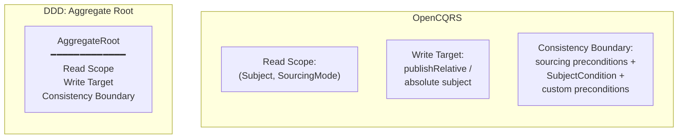
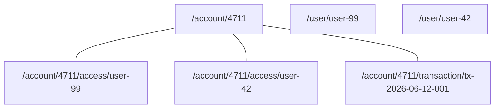
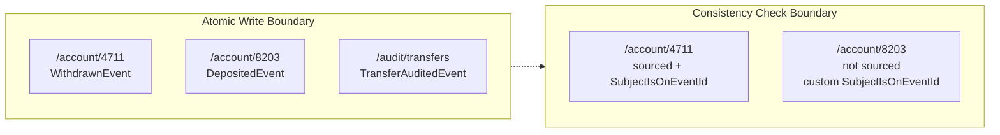
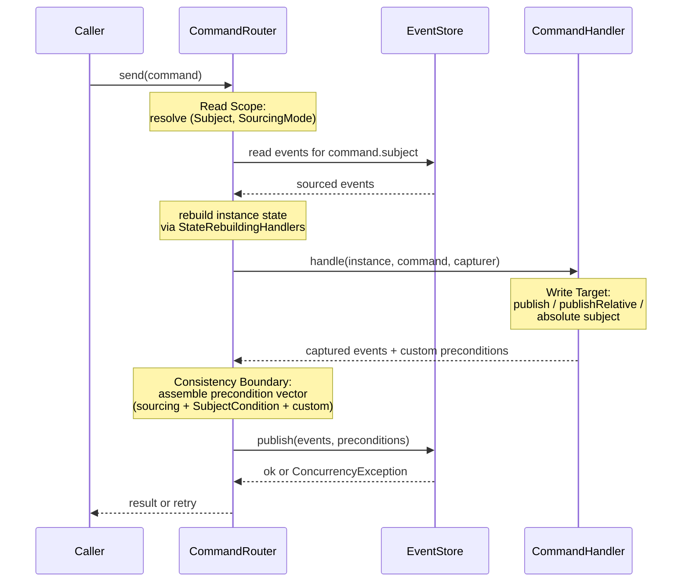

# Beyond the Aggregate Root: How OpenCQRS Decouples What You Didn't Know Was Conflated

A few weeks ago, a colleague new to OpenCQRS posted a question in our team Slack:

> "I want to grant a user access to a shared bank account. Where does the `AccessGrantedEvent` go - under `/account/{id}` or under `/user/{id}`?"

This question is familiar to anyone who has worked with Domain-Driven Design or with the Aggregate pattern. Any system built on those ideas eventually asks it: a change has to be recorded somewhere, several candidates could own it, you pick one. The conceptual core is small, and most of the time the answer is obvious within seconds. The case from the Slack thread above is the kind that does not resolve as quickly - and the reason it does not is worth unpacking, because it says something about the model underneath.

The reason is not the framework. It is the mental shadow that an older idea casts on your thinking. The Aggregate Root was supposed to give you exactly one place to anchor a write: a single identity, a single boundary, a single coordinator. In OpenCQRS that anchor has been dissolved into three independent mechanisms - and once you see the three separately, the question from the Slack thread answers itself.

This article is about what the Aggregate Root was actually doing, why OpenCQRS deliberately splits it apart, and how the three concepts that used to be welded together become three orthogonal dimensions you get to shape per command. By the end, the question from the Slack thread will have a clean answer - and you will see what was actually being conflated.

<!-- more -->

## What the Aggregate Was Really Doing

The Aggregate Root has a strong reputation. Vaughn Vernon's *Implementing Domain-Driven Design* canonized it. Eric Evans positioned it as the cornerstone of tactical DDD patterns (1). Generations of developers learned to model their domain by drawing boundaries, picking a root, and routing every command through it. The pattern works when it works, and it works for a clear reason: it gives you one type that owns three things at the same time.
{ .annotate }

1.  Evans introduced the Aggregate Root in *Domain-Driven Design* (Addison-Wesley, 2003) - the *Blue Book*. Vernon's *Implementing Domain-Driven Design* (Addison-Wesley, 2013) - the *Red Book* - is the de-facto handbook for applying the pattern in production systems.

The first thing it owns is the **anchor for state reconstruction**. When a command arrives, the framework loads the events that belong to this Aggregate, replays them through the Aggregate class, and hands you a reconstructed object. There is no question of which events to load, because membership in the Aggregate is settled by the type. Every event tagged with this Aggregate's identifier comes back. Nothing else does.

The second thing it owns is the **target identity for new events**. When the Aggregate validates a command and decides to emit events, those events are written to the Aggregate's stream. The identity of the Aggregate becomes the address of the new events. You do not pick a destination, because the Aggregate is the destination.

The third thing it owns is the **consistency boundary** - and this is the role that most often goes unexamined. Inside the Aggregate, everything is transactionally consistent: the framework guarantees that the events you emit will only be appended if the Aggregate has not been modified concurrently. Between Aggregates you are told to settle for eventual consistency. This is not an implementation detail; it is the strategic point of the pattern, the reason DDD treats the Aggregate as the unit of transactional safety.

The following diagram makes the conflation visible. On the left, all three roles live inside one type. On the right, OpenCQRS provides them as three independent mechanisms:



Three roles, one type. The Aggregate Root makes the three roles look like one concept because it forces them to share the same identity. That is exactly where the stall in the Slack thread comes from: you are looking for the one identity to anchor a grant of access on, because the Aggregate mental model has trained everyone to expect that identity to exist. The Aggregate's success at hiding the conflation is precisely the reason that its removal feels disorienting at first.

## Read Scope - Where State Comes From

Strip the Aggregate Root away and the first of its three roles emerges in its own shape. **[State reconstruction](../../../../reference/extension_points/state_rebuilding_handler/index.md)** in OpenCQRS is governed by the **Read Scope**, which is a tuple of two things attached to each command: the command instance's subject and the command class's `SourcingMode`. Both are values, not types. Both can change per command type, even for commands that touch what looks like the same business object.

The subject is a hierarchical path. It looks like `/account/4711`, `/account/4711/access/user-99`, or `/account/4711/transaction/tx-2026-06-12-001`. The path is semantic, not just a string convention. The framework understands that `/account/4711/access/user-99` lives underneath `/account/4711`, and that "underneath" is a real relationship. The `SourcingMode` then tells the framework how to interpret the subject when reading.

The Shared Bank Account domain we'll use throughout this article has the following subject tree:



Accounts live at the top of their own subtree. Access grants and transactions live as descendants of their account. Users live in a separate, parallel hierarchy. There is no implicit ownership of users by accounts and no implicit ownership of accounts by users. The relationship between them will be expressed through preconditions, not through the path.

The `SourcingMode` enum is short enough to read in full (Javadoc tags rendered as text):

```java
public enum SourcingMode {

    /** No events will be fetched for the Command's subject. */
    NONE,

    /** Events will be fetched for the Command's subject non-recursively. */
    LOCAL,

    /** Events will be fetched for the Command's subject recursively. */
    RECURSIVE
}
```

A `GrantAccessCommand` with subject `/account/4711` and `RECURSIVE` returns the account itself plus every existing access grant and transaction beneath it. That is more than the handler strictly needs, but it is precisely the scope that lets it count signers and decide whether the new grant is permitted. A `DepositCommand` at the same subject with `LOCAL` returns only the account-level events. Same business object, two different read scopes, decided per command. The Aggregate Root forced you to load the whole instance every time, because the Aggregate *was* the load unit. OpenCQRS makes the load unit a per-command decision.

## Write Target - Where Events Go

The next role the Aggregate Root used to play is the destination for new events. In OpenCQRS the destination is set explicitly by the **[command handler](../../../../reference/extension_points/command_handler/index.md)**, and the command's subject is *not* automatically the destination. This is the single sentence that resolves the question from the Slack thread: **the command's subject is the read anchor, not the identity of the thing being modified**.

The handler receives a `CommandEventPublisher` and uses it to emit events. The interface offers two convenience families and one inherited fallback. `publish(event, ...)` writes the event to the command's subject. `publishRelative(subjectSuffix, event, ...)` writes the event to a path constructed by appending a suffix to the command's subject. The inherited `publish(subject, event, ...)` method takes any absolute subject and writes the event there.

```java
public interface CommandEventPublisher<I> extends EventPublisher {

    <E> I publish(E event,
                  Map<String, ?> metaData,
                  List<Precondition> preconditions);

    <E> I publishRelative(String subjectSuffix,
                          E event,
                          Map<String, ?> metaData,
                          List<Precondition> preconditions);

    // plus convenience overloads without metaData / preconditions
}
```

Now apply this to the question from the Slack thread. A `GrantAccessCommand` is dispatched with subject `/account/4711`. The handler sources the account state and any existing grants recursively, validates that the new grant is permitted, and calls `publishRelative("access/user-99", new AccessGrantedEvent(...))`. The event lands at `/account/4711/access/user-99`. The read scope was the account; the write target is a fresh subject one level deeper; the two are independent decisions made by independent mechanisms.

??? tip "publishRelative is sugar"

    `publishRelative("access/user-99", event)` is a convenience that builds on the base `EventPublisher.publish(subject, event, ...)` method inherited via the parent interface. The full power - emit to *any* absolute subject from inside a command handler - is available via that base method. Prefer `publishRelative` when the destination is a child of the command's subject, because the relationship is documented in the call site itself. Fall back to the absolute-subject variant when the destination is genuinely outside the command's hierarchy, like a system-wide audit log.

If the same handler also needs to emit an audit record to a system-wide audit subject, it falls back to the absolute-subject publish method inherited from `EventPublisher`. The event goes to `/audit/access-changes`, completely outside the read scope of `/account/4711`. That second event still rides on the same atomic write batch as the access grant, although the absolute-subject path is state-rebuilding-blind: no `StateRebuildingHandler` is applied to it, because it does not belong to the command's instance. One command, two destinations, both atomic.

## Consistency Boundary - What Must Not Change

The third role - the consistency boundary - is where the three-way split becomes most concrete. In the Aggregate model, the boundary is fixed by the type and enforced through a version check on the Aggregate root. In OpenCQRS there is no typed root and therefore no Aggregate version. The consistency boundary is composed at runtime from three independent pieces of evidence, all of which feed into a single vector of **[preconditions](../../../../reference/extension_points/command_handler/index.md)** attached to the atomic write.

The first piece comes for free from the sourcing scope. For every subject whose events the framework reads while reconstructing state, a `SubjectIsOnEventId` precondition is automatically added to the write. The condition says: this subject must still be at the same event id I observed when I read it, otherwise refuse the write. For every subject inside the sourcing scope that the handler writes to fresh, a `SubjectIsPristine` precondition is added: this subject must not have been touched between my read and my write. The developer writes no consistency code for either.

The second piece comes from the command itself. `Command.SubjectCondition` is a declarative property on the command class: `NONE`, `EXISTS`, or `PRISTINE`. It is checked before the handler runs and it informs an additional precondition added to the atomic write. A `GrantAccessCommand` declares `EXISTS` on `/account/4711`, which means "refuse the command if no events have ever been recorded for this account." The framework validates this at sourcing time and enforces it as a `SubjectIsPopulated` precondition at publish time.

!!! warning "PRISTINE and EXISTS require non-NONE sourcing"

    The two declarative `SubjectCondition` checks - `PRISTINE` ("subject must be empty") and `EXISTS` ("subject must have at least one event") - can only be evaluated if the framework actually reads events for that subject. With `SourcingMode.NONE`, no events are sourced and the framework has no basis to check the condition before the handler runs. Use `LOCAL` or `RECURSIVE` whenever the command declares anything other than `SubjectCondition.NONE`.

The third piece is the most powerful, and it is the one that most clearly shows the decoupling. Every captured event can carry its own list of preconditions through `CapturedEvent.preconditions()`. The handler can attach `SubjectIsOnEventId("/user/user-99", lastSeenUserEventId)` to the access-granted event, and that condition will be enforced atomically with the write - even though `/user/user-99` was never in the sourcing scope. This is the escape hatch the typed Aggregate does not offer as a first-class affordance. The relevant fragment from `CommandRouter.send` shows the three pieces coming together as a single vector:

```java
// new subjects within sourcing scope -> SubjectIsPristine
List<Precondition> additionalPreconditions = events.stream()
        .map(CapturedEvent::subject)
        .filter(subject -> /* subject is inside sourcing scope */)
        .filter(subject -> !sourcedSubjectIds.containsKey(subject))
        .map(Precondition.SubjectIsPristine::new)
        .collect(toList());

// declarative SubjectCondition -> SubjectIsPristine or SubjectIsPopulated
switch (command.getSubjectCondition()) {
    case PRISTINE -> additionalPreconditions.add(
        new Precondition.SubjectIsPristine(command.getSubject()));
    case EXISTS   -> additionalPreconditions.add(
        new Precondition.SubjectIsPopulated(command.getSubject()));
}

// every sourced subject -> SubjectIsOnEventId at the last seen id
sourcedSubjectIds.entrySet().stream()
        .map(e -> new Precondition.SubjectIsOnEventId(e.getKey(), e.getValue()))
        .collect(toCollection(() -> additionalPreconditions));

// custom per-event preconditions
events.stream()
        .flatMap(e -> e.preconditions().stream())
        .collect(toCollection(() -> additionalPreconditions));

immediateEventPublisher.publish(events, additionalPreconditions);
```

There is no Aggregate version anywhere in this code. There is no shared root, no global lock, no notion of a "current version" tied to a typed instance. There is just a vector of facts about what must still be true at write time, assembled incrementally from what the command was given and what the handler did. The framework hands the vector and the events to a single atomic publish call, and the event store either accepts the whole batch or rejects it.

## When Subjects Don't Share a Hierarchy

So far the examples have been comfortable. Accounts and their access grants share a subject path. Sourcing recursively from `/account/4711` covers the whole picture you need to validate a new grant. The three-dimensions decoupling shines exactly where DDD's Aggregate Root would have shone too: a parent and its children, cleanly bounded.

The genuinely harder case is the one where the coordination cannot be reduced to a single decision: when multiple instances each carry their own write-side rule that can fail independently and needs explicit compensation when a later step fails. That is what DDD has always solved with Sagas, and OpenCQRS handles it the same way - through choreography of commands and compensating events. **A worked example of a real Saga in OpenCQRS - and the question of when you genuinely need one - belongs in its own article.**

??? info "A worked Saga example"

    The OpenCQRS samples repository includes a runnable Saga at **[opencqrs-samples/implementing-sagas](https://github.com/open-cqrs/opencqrs-samples/tree/main/implementing-sagas)**. The domain is a library lending workflow: `Reader` enforces "at most two active loans" on its own state, `Book` enforces "only one borrower at a time" on its own state, and a `Loan` instance coordinates between them. The `@EventHandling("loan")` methods on `LoanHandling` react to events emitted by Reader and Book, dispatch follow-up commands through `CommandRouter`, and route compensating commands (`RejectBookRequestCommand` → `RemoveLoanFromReaderCommand` → `CancellLoanCommand`) when a step downstream fails. The structural point of the sample is that in OpenCQRS a Saga is not a special concept - it is an ordinary instance with ordinary `@CommandHandling` and `@EventHandling` methods whose state happens to be a workflow.

The cross-account transfer this section is about is *not* that case. The decision *"is this transfer allowed?"* is one rule, sitting in the transfer handler; `/account/4711` and `/account/8203` are data sources for that one rule, not instances with their own competing decisions. That distinction is exactly why the three independent mechanisms still help here, even though the two subjects share no hierarchy.

Mechanically, it works like this. The handler injects an `EventReader` and uses it to source `/account/8203` directly, *outside* the framework's automatic sourcing. The state of the second account is rebuilt in memory, strong-consistent from the event store - not from a **[read model](../2026-03-19-one-truth-many-views/index.md)**, which would be eventually consistent and risk a stale decision. During that side-source, the handler also remembers the latest event id observed for `/account/8203`. The handler validates against both balances, captures a `WithdrawnEvent` on `/account/4711` and a `DepositedEvent` on `/account/8203`, and attaches a custom precondition `SubjectIsOnEventId("/account/8203", lastSeenIdOfB)` to the deposit event. If the second account moved on between the side-source and the atomic publish, the write fails and the handler retries.

??? info "Why not a Read Model?"

    For a state-dependent decision about `/account/8203`, sourcing the events directly from the event store gives you a strong-consistent view of the account *at this moment*. A read-model lookup would not. Read models are eventually consistent by definition - your decision could be based on a snapshot that lags behind reality, and the `SubjectIsOnEventId` precondition would only catch the staleness at write time, not at decision time. Read models are the right answer when the only question is *existence*; they are not the right answer when a business rule depends on the current value of state that another command can change.

```java
@CommandHandling(sourcingMode = SourcingMode.RECURSIVE)
public void transfer(Account a, TransferCommand command,
                     CommandEventPublisher<Account> publisher,
                     @Autowired EventReader eventReader) {
    // Side-source /account/B and remember its latest event id.
    AtomicReference<String> lastSeenIdOfB = new AtomicReference<>();
    Account b = sourceAccount(eventReader, command.targetSubject(), lastSeenIdOfB);

    if (a.balance().compareTo(command.amount()) < 0) throw new InsufficientFundsException();
    if (b.isFrozen()) throw new TargetFrozenException();

    publisher.publish(new WithdrawnEvent(command.amount()));
    publisher.publish(
        command.targetSubject(),
        new DepositedEvent(command.amount()),
        Map.of(),
        List.of(new Precondition.SubjectIsOnEventId(
            command.targetSubject(), lastSeenIdOfB.get())));
}
```

The handler does two non-trivial things the framework cannot do for it: side-sourcing `/account/B` through `EventReader` instead of through `Command.getSubject()`, and threading the observed event id into a hand-attached `SubjectIsOnEventId` precondition on the deposit event. The atomic publish at the end is the same one the framework would have done anyway; it just now carries an extra precondition the framework would never have inferred on its own.

You could call this **transactional consistency through the back door** (1). Two-subject Optimistic Concurrency Control, enforced through preconditions instead of through a shared lock. In an Aggregate-bound model, you can build this too - but the precondition plumbing has to be assembled by hand, outside the framework's command pattern. OpenCQRS does not promise more than a classical Aggregate for cross-hierarchy cases, but it does offer the precondition vector as a first-class affordance when a single command genuinely needs to span subjects.
{ .annotate }

1.  Shorthand for two-subject Optimistic Concurrency Control over a per-event precondition vector. The "transactional" property is the all-or-nothing semantics: the atomic publish either commits every event with all observed preconditions still intact, or commits none. The "back door" part is the dependency on the developer to assemble that vector by hand, rather than inheriting it from a typed boundary.

The next diagram makes the subtle distinction explicit. The atomic write boundary - "either all my events land or none do" - is broader than the consistency check boundary. An OpenCQRS command can write atomically across subjects it never sourced, and it can extend the consistency check to subjects it never wrote to. These are two different boundaries that classical Aggregates kept welded together:



There is a broader framing for consistency boundaries that I will only gesture at here: **Dynamic Consistency Boundaries** (DCB), in the sense developed by Sara Pellegrini (1), treat the boundary as a predicate over events rather than as a set of subject identifiers. That is a fundamentally different model from the subject-id-based preconditions OpenCQRS uses today, with its own implications for how you express consistency, how you reason about boundaries, and how the read and write paths are shaped. OpenCQRS sits between the typed-Aggregate model and DCB - more flexible than the former, narrower than the latter. A serious treatment of DCB belongs in a dedicated article, not in a side note here.
{ .annotate }

1.  Pellegrini introduced and developed the Dynamic Consistency Boundaries pattern in conference talks and writing as a generalization of event-sourced consistency. The defining shift: a consistency boundary becomes a predicate over events (a query) rather than a bounded type or a set of subject identifiers - which means events that satisfy the predicate participate in the boundary, regardless of where they physically live in the event store.

??? info "The Phantom-Subject Limit"

    Subject-id preconditions cover everything *you saw* and everything *you wrote to*. They do not cover subjects that another command creates concurrently in the same logical scope. Imagine a regulatory limit of three authorized signers per joint account. Each signer grant is its own subject under `/account/{id}/access/{userId}`. Your handler sources `/account/4711` recursively, counts two existing grants, and writes the third. So does a parallel handler, with a different `userId`. Both writes pass: yours has `SubjectIsOnEventId` for the two grants you saw, plus `SubjectIsPristine` for the new grant *you* are writing - and that says nothing about the *other* new grant the parallel handler is writing on a different `userId`. The account ends up with four signers, and the regulatory limit is broken.

    The OpenCQRS documentation flags this honestly: "concurrent event publication to relative subjects ... cannot be prevented." This is not a property of the three-dimensions decomposition; it is a missing affordance at the event-store layer - there is no precondition of the form *"this subject is on event id X recursively, including all descendants."* You can always wedge the check in at the application layer, but anything built there is structurally weaker than a transactional check inside the event store. The same gap exists in a classical Aggregate-bound model: the only way Aggregates would catch this race for free is by making the entire account, with every present and future access grant, one giant Aggregate - and nobody actually designs that way. Closing the gap properly belongs at the event-store layer. A broader rethink along the lines of Dynamic Consistency Boundaries is a separate, larger design question for a future article.

## What This Buys You

Three decoupled dimensions buy you something concrete: each command shapes its own boundaries. The same business object can be touched by different commands with different read scopes, different write targets, and different consistency demands - without any of those decisions being locked in at type level, though the discipline of getting the runtime composition right shifts to the developer. A `GrantAccessCommand` reads recursively, writes one level deep, and demands strong consistency on a user record outside its hierarchy. A `DepositCommand` reads locally, writes to its own subject, and demands nothing more than that the account still exists. Both touch the same account. Neither has to compromise to fit a shared mold.

The lifecycle of a single command makes the three dimensions visible end to end. The router sources the events it needs, the handler decides what to write, and the framework assembles the precondition vector and publishes everything in one atomic batch. Each dimension contributes independently to that batch:



The diagram exposes what the prose has been arguing. Read Scope is decided at the top, before the handler runs. Write Target is decided in the middle, by the handler itself. Consistency Boundary is assembled at the bottom, from everything that came before plus what the handler chose to attach. No single point in this lifecycle owns more than its own concern, and no Aggregate-like identity travels through end to end carrying all three.

The closing answer to the Slack question is now small and unambiguous. `AccessGrantedEvent` goes to `/account/{id}/access/{userId}` because the **command** is dispatched against `/account/{id}` - the read anchor - and the handler chooses the write target one level deeper via `publishRelative`. The consistency boundary is composed from the account's `EXISTS` condition, the sourcing-scope preconditions, and an optional custom check that the user record has not changed. Three decisions, three mechanisms, one command. The feeling of needing one place to put the event came from a model that still assumed a single anchor. Once the anchor splits into three, every plausible answer becomes precise.

There is a sibling article waiting to be written. If the Aggregate Root is missing in OpenCQRS, so is the Saga as a special concept. Cross-subject business processes do exist - I gestured at the transfer scenario above - and they are coordinated in OpenCQRS by ordinary subjects with ordinary command and event handlers. No special Saga type, no special process-manager abstraction, just another instance whose state happens to be a workflow. The "Missing Aggregate" has a sibling called the "Missing Saga," and I will write that piece next.

OpenCQRS does not remove the Aggregate to be different. It removes it because conflation hides the actual structure.

*[OCC]: Optimistic Concurrency Control - concurrency strategy that does not block on read, instead validating that observed state has not changed at write time.
*[DCB]: Dynamic Consistency Boundaries - Sara Pellegrini's framing of event-store consistency expressed as a predicate over events rather than as a bounded type.
*[OpenCQRS]: An opinionated, lightweight Java/Kotlin framework for CQRS and Event Sourcing on top of EventSourcingDB, maintained by digital frontiers.
*[CommandRouter]: The OpenCQRS core component that routes commands to their handlers, sources the relevant events, assembles the precondition vector, and publishes the resulting events atomically.
*[CommandEventPublisher]: The interface a command handler uses to publish events during command execution. Offers publish(event), publishRelative(suffix, event), and inherits publish(absolute-subject, event) from EventPublisher.
*[StateRebuildingHandler]: An OpenCQRS extension point that applies events to a state object to reconstruct the current instance state before a command handler runs.
*[EventReader]: The OpenCQRS persistence-layer interface for reading events from the event store, by subject and SourcingMode.
*[SourcingMode]: A property of a command handler definition that controls how events are read for the command's subject: NONE, LOCAL (just that subject), or RECURSIVE (subject and all descendants).
*[Saga]: A coordination pattern that mediates between multiple instances each carrying their own write-side rule, using event handlers and compensating commands. In OpenCQRS, a Saga is just another instance with regular handlers - no special framework concept.
*[CapturedEvent]: An event captured in memory during command handling, carrying its subject, payload, metadata, and any custom preconditions, before the atomic publish to the event store.
